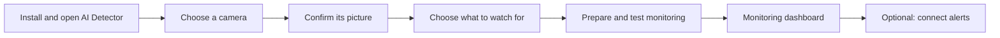

# Installation and onboarding for nontechnical users

Assessment date: 22 September 2026. Source baseline: `5c020e429a`.

For a fresh review of the implemented working tree, remaining friction and Telegram pairing/provisioning options, see the [onboarding reassessment](ONBOARDING_REASSESSMENT.md). It distinguishes current behavior from the next proposed changes; the baseline assessment below remains historical.

## Implemented foundations

The assessment below records the starting point. The working tree now implements the camera onboarding, operational status and desktop installation foundations described in this ledger. Source implementation and local verification do not constitute a qualified signed release.

| User journey                               | Implemented in this change                                                                                                                                                                                                                                                       | Evidence and remaining qualification                                                                                                                                                                                                                                                                                                                                                                                     |
| ------------------------------------------ | -------------------------------------------------------------------------------------------------------------------------------------------------------------------------------------------------------------------------------------------------------------------------------- | ------------------------------------------------------------------------------------------------------------------------------------------------------------------------------------------------------------------------------------------------------------------------------------------------------------------------------------------------------------------------------------------------------------------------ |
| Open without hardware choices              | Native-first automatic mode, expected Windows ML acquisition failure falls back to CPU; explicit Docker override remains advanced.                                                                                                                                               | Runtime tests; actual Windows GPU/provider qualification remains required.                                                                                                                                                                                                                                                                                                                                               |
| Connect first or additional camera         | ONVIF discovery/profile lookup, separate credentials, real picture and playable setup recording, opaque URLs, stable camera IDs.                                                                                                                                                 | Real SOAP fixture and FFmpeg tests; browser first/second-camera flow. Physical camera/network permission matrix remains required.                                                                                                                                                                                                                                                                                        |
| Start and understand monitoring            | Server-start initialization, preparation status, fresh frames and all configured rules required for monitoring; independent recording failures.                                                                                                                                  | Python status/inference tests and web aggregation tests. Camera checks do not establish detection accuracy or adequate hardware capacity.                                                                                                                                                                                                                                                                                |
| Expand without connecting internal objects | Camera and rule assignment saved together, existing rule copying, preset edits preserve deliveries; guided Telegram assignment and test receipt confirmation.                                                                                                                    | Configuration/assignment tests; real Telegram delivery deliberately not sent during development. Hosted account-free pairing remains a separate service decision.                                                                                                                                                                                                                                                        |
| Save settings without ambiguous retries    | Changed detector settings and metadata are staged together; ordinary replacement failure restores metadata. Once files are committed, runtime application failures appear in monitoring status instead of rejecting the completed save. Metadata-only edits avoid restarts.      | Configuration regressions cover staging, commit, rollback, cleanup, missing-file recovery and real managed-stop settings-write failure. This is one-process coordination, not power-loss atomicity or a configuration backup feature.                                                                                                                                                                                    |
| Keep daily view open                       | Recordings refresh automatically, defer insertion during playback/scroll, expose monitoring health and explicit persistent pause.                                                                                                                                                | Browser playback and incoming-recording checks.                                                                                                                                                                                                                                                                                                                                                                          |
| Reopen without repeated preparation        | ONNX preparation cache keyed by checkpoint bytes, export options and SDK versions.                                                                                                                                                                                               | Fresh frozen detector exported and ran twice; unchanged prepared graph and a single download verified.                                                                                                                                                                                                                                                                                                                   |
| Install and reopen normally                | macOS app/menu/login integration and DMG tooling; per-user Inno Setup installer; Ubuntu 22.04/24.04 amd64 package; verified local-instance reopening and graceful upgrade/quit protocol. Tagged-release Windows signing and macOS signing/notarization are wired to credentials. | Local launcher/protocol/package fixtures, Swift compilation and an unsigned DMG creation/verification passed. The workflow builds on native runners and repeats payload smoke after signing. Actual signed downloads, OS installation/upgrade, login startup and GPU qualification remain release gates; no production signature or hardware qualification was established locally. Desktop login is not pre-login boot. |

Still outside the completed slices: full storage/retention UI, configuration backup/restore and verified in-app updates, sleep inhibition and measured capacity guidance, complete Dutch localization, appliance image qualification, and observed novice-user acceptance tests. Do not describe these as shipped or infer them from a successful build. The delivery gates below remain the release checklist.

Installation details and credential names are maintained in the [distribution guide](distribution/README.md); save behavior and its failure limits are maintained in the [web architecture guide](web/ARCHITECTURE.md#settings-save-boundary). The macOS menu currently provides Open dashboard, Open at login and Quit. Monitoring status and Pause are in the browser; a Windows/Linux tray menu and native monitoring controls are not implemented. Local installer tests used temporary files and fixture processes; they did not install services, register login items or change this computer's startup settings.

The original assessment below describes the source baseline and proposed product design; use the implementation ledger above for current progress. It covers installation, first-camera setup, daily use, expansion, maintenance and recovery. The initial assessment itself changed no runtime behavior; implementation followed it. The existing test suite establishes useful engineering contracts, but novice usability still needs observation with real users and supported cameras.

## Local verification of this implementation

- The Python suite passed 419 tests. Fresh Python 3.11 frozen executables passed ONNX and PT inference smoke tests; the PT test also proved reuse of the prepared model on a second launch.
- The web suite passed 129 tests. Svelte checking found no errors or warnings; lint and formatting passed. Dependency checks found no violations across 543 modules and 2,333 dependencies.
- Five production HTTP integration tests passed: local, LAN and HTTPS-proxy setup; verified camera saving/media; and cancellation after the request body was consumed. Cancellation stopped real FFmpeg, removed the incomplete recording and allowed an immediate successful retry.
- Distribution tests passed (21 tests, one Linux desktop-tool check skipped on macOS); six desktop-instance protocol tests passed. The Swift launcher compiled for macOS 14. The complete local app bundle started the actual detector and created an archive. Its compiled web executable passed ONVIF profile lookup, JPEG/MP4 verification, camera save, cancellation, second launch and authenticated quit checks.
- Browser checks covered first/additional cameras, copied settings and draft restoration, unavailable-first-channel NVR recovery, recording confirmation, mobile error guidance, live preview/retry, alert receipt gating and recipient changes during delayed requests. Alert assignment was checked in the saved configuration. Recording refresh preserved playback and scroll. Desktop and mobile layouts were inspected at 1,440 and 390 pixels.

Camera traffic and media in these checks were synthetic and local. Browser runtime status used a fixture; actual detector inference and export were checked separately in the frozen executable. Telegram responses were intercepted: no real messages were sent. Browser console failures intentionally induced by unavailable cameras and terminated finite streams were distinguished from the healthy-path checks. Physical cameras, network discovery permissions, signed installation and novice-user observations remain separate release gates.

## Product decision

The application should own the journey from download to verified monitoring. Users should make decisions about their farm: which camera, what to watch for, and who receives alerts. GPU vendors, execution providers, Docker, model paths, stream URLs and process lifetimes belong behind the product interface.

Revise the earlier NVIDIA-implies-Docker decision. A detected GPU is not evidence of a working container environment, nor a reason to require one. Prefer the bundled native runtime on supported desktop computers, choose and test available acceleration internally, and use a verified CPU path when optional acceleration is unavailable. Show an honest capacity result if that machine cannot keep up.

For the least technical customers, offer a preconfigured monitoring device as a first-class distribution. Supporting an arbitrary existing computer and supplying a known working appliance are different product promises. A supported device plus a supported camera gives us much more control over installation, drivers, sleep, boot and recovery.

## Current barriers, grounded in the code

| Priority | Current behavior                                                                                                                                     | User consequence                                                                                                                      | Evidence                                                                                                  |
| -------- | ---------------------------------------------------------------------------------------------------------------------------------------------------- | ------------------------------------------------------------------------------------------------------------------------------------- | --------------------------------------------------------------------------------------------------------- |
| P0       | Automatic runtime chooses Docker when `nvidia-smi` reports a GPU; missing Docker fails startup.                                                      | Owning an NVIDIA card can make installation harder even though a native executable is included.                                       | `web/src/lib/server/runtime-platform.ts:34`, `managed-detector.ts:122` and `:164`                         |
| P0       | First-camera setup requires a complete RTSP/HTTP address, with credentials embedded in the example.                                                  | The user must understand camera-specific URLs before seeing a picture.                                                                | `web/src/routes/(admin)/setup/+page.svelte:75`                                                            |
| P0       | Configuration checking validates the configuration; runtime becomes `running` when the child process spawns.                                         | A green-looking process state does not prove the camera, model or recording works.                                                    | `web/src/lib/server/managed-detector.ts:86` and `:272`; `detector/src/aidetector/cli.py:101`              |
| P0       | Adding a camera creates reusable source metadata but does not assign the new source to a detector.                                                   | “Stream saved” can mean that the camera is not monitored.                                                                             | `web/src/lib/server/configuration/store.ts:107`                                                           |
| P0       | Adding a Telegram channel does not attach it to a detector.                                                                                          | A saved channel, even one that can send a test message, need not receive detections.                                                  | `web/src/lib/server/configuration/store.ts:161`                                                           |
| P0       | Downloads are unsigned ZIPs with required adjacent folders; macOS receives a `.command` launcher.                                                    | Extraction, preserving folder structure and OS launch warnings remain the user's problem.                                             | `distribution/package.py:23`; `distribution/README.md`, Release limits                                    |
| P0       | Detections has no persistent monitoring status and no automatic refresh of newly arriving records.                                                   | An empty page cannot distinguish healthy waiting from a stopped or disconnected detector; new events need not appear on an open page. | `web/src/routes/(admin)/detections/+page.svelte:138` and `:188`                                           |
| P1       | Native startup is initialized by the first HTTP request. No installed background service exists.                                                     | Reopening the app normally resumes detection, but boot without browser activity is not a complete unattended-start contract.          | `web/src/hooks.server.ts:5`; `web/src/lib/server/detector-service.ts:11`                                  |
| P1       | START HERE says to stop detection before closing; Stop disables saved automatic resume.                                                              | Following the instructions can leave the next session paused.                                                                         | `distribution/package.py:46`; `web/src/lib/server/managed-detector.ts:296`                                |
| P1       | Model acquisition/preparation appears mainly in logs, and native `.pt` startup enters the export branch again.                                       | Startup can look stalled, and repeated preparation adds avoidable delay.                                                              | `detector/src/aidetector/adapters/inference/model_assets.py`; `yolo.py:185`                               |
| P1       | Windows ML provider initialization/download errors propagate before a CPU fallback.                                                                  | “Use native” is not yet a complete reliability solution.                                                                              | `detector/src/aidetector/adapters/inference/onnx.py:108` and `:216`                                       |
| P1       | Editing uses separate Sources/Streams, Detectors and Notifications concepts. Changing a preset replaces the draft.                                   | Users must connect implementation objects themselves and can lose camera/notification selections when changing the watched behavior.  | `web/src/routes/(admin)/+layout.svelte:19`; `detectors/add/detector-editor.svelte:83`                     |
| P1       | Camera source strings appear in overlays and editing URLs.                                                                                           | Credentials can become visible while navigating or asking for help.                                                                   | `web/src/routes/(admin)/streams/stream.svelte:60` and `:96`                                               |
| P1       | Updates and backups require folder operations; no user-facing storage/retention controls exist.                                                      | Long-running installations need technical maintenance after onboarding.                                                               | Root README, Your settings and recordings; `DiskConfig` in `detector/src/aidetector/configuration.py:206` |
| P1       | Jetson setup assumes JetPack, Docker/runtime tools, a repository checkout and terminal commands; configuration changes still need a Compose restart. | The current Jetson instructions target an installer, not the farmer.                                                                  | Root README, Start automatically on a Jetson or Linux desktop                                             |

The existing combined package, bundled dependencies, offline preset definitions, individual-file atomic renames, shared captures and executable smoke tests are useful foundations. Keep them and build the missing user journey around them.

## The proposed first-run experience

### 1. Download and install

Provide one public download page. Recommend the likely OS download and let the installer verify architecture and supported OS versions. Browser detection is a convenience, not a hardware capability check. Do not ask the user to choose CPU, CUDA, Windows ML or Docker. Unsupported systems need an understandable explanation before a large download or failed launch.

Windows should have a signed installer with Start-menu entry, uninstall and upgrade support. macOS should have a signed, notarized `.app` with a normal installation experience. Choose a deliberately supported Linux desktop distribution/package path; do not promise one binary for every Linux installation. Retain portable ZIPs for technical users.

A second launch should open the existing dashboard, not start another detector or report an unexplained occupied port. Add a small tray/menu-bar entry for Open dashboard, monitoring status and Pause monitoring. Retain the Svelte web interface; this does not require rewriting the product as a desktop UI.

### 2. Find and identify the camera

Offer “Find cameras” and show discovered devices by useful name, model and address. Use ONVIF discovery and stream-profile information where supported, through an existing maintained implementation. Run discovery from the installed application; a browser alone cannot perform the required local network discovery.

Ask separately for camera username and password when needed. Show a live picture and ask “Is this the right camera?” Offer a plain camera name such as “Calving pen.” Store a stable camera identity so changing its name, address or password does not break monitoring and alert relationships. Where the OS requires local-network or firewall permission, explain the prompt in context and provide a clear recovery path if permission was denied.

Discovery will not cover every installation. Keep an assisted “Camera not found” path with device address, supported brand/model help, and an advanced stream-address option. Handle cameras on another subnet, disabled ONVIF, NVR channels, and cameras that only work through a vendor cloud app explicitly. Do not imply every camera is compatible or that the application can discover forgotten passwords.

Use truthful, differentiated errors: password rejected, camera not reachable, stream unsupported, or connection failed with an unknown cause. Do not label every failure a wrong password or promise diagnosis the capture library cannot provide.

### 3. Choose the outcome

Ask “What should we watch for?” with tested presets and a short explanation of appropriate camera placement and the observable event. Keep technical tuning behind Advanced. A general-object preset should allow selecting relevant events instead of unexpectedly alerting on everything.

Use recommended recording and detection defaults. Camera orientation and visibility affect usefulness; a working decoder does not establish useful calving detection. Provide a simple placement checklist and example images for each supported preset.

### 4. Prepare, verify and begin

One primary action should enable monitoring and show actual progress:

1. Preparing detection software/model; show byte progress when available and honest stage text otherwise.
2. Connecting the camera and receiving recent frames.
3. Running the chosen model successfully on that camera.
4. Saving and opening a short test recording.
5. Showing “Monitoring Calving pen” with the latest picture time.

The recording must be clearly marked as a setup test. Do not fabricate a calving event or wait for one to prove installation. Separately test the event aggregation and delivery path with known test media. A setup self-test demonstrates operation, not detection accuracy.

Persist draft choices and preparation state sufficiently to resume an interrupted setup. A failed download should offer Retry; it should not erase the selected camera or ask the user to restart the whole wizard.

### 5. Optional alerts

Users can complete local monitoring without an account or notification configuration. When they choose alerts, connect a recipient, send a clearly identified test, ask them to confirm receipt on the intended phone/chat, choose the cameras/events, and finish with an explicit attachment summary: “Alerts enabled for Calving pen.” An API accepting the message does not establish that the user received or noticed it.

The baseline self-managed Telegram option requires a bot token and chat ID. Guided instructions, assisted chat discovery and camera assignment are now implemented. QR pairing for a user-owned bot can be added locally after token entry; a shared project-operated bot requires a hosted pairing/delivery service. Telegram also documents managed personal-bot creation, which offers a separate provisioning approach. See the [reassessment](ONBOARDING_REASSESSMENT.md#telegram-removing-token-copying-entirely) for the current options and their infrastructure requirements. Keep alerts optional and do not delay local monitoring for them.

## Automatic hardware handling

| Environment                 | Proposed default                                                                                      | Required proof                                                                                                             |
| --------------------------- | ----------------------------------------------------------------------------------------------------- | -------------------------------------------------------------------------------------------------------------------------- |
| Supported Windows PC        | Bundled native runtime; use Windows ML capabilities where compatible; verified CPU fallback.          | Actual selected-model inference, including failed/unavailable optional provider installation and older supported hardware. |
| Supported Apple Silicon Mac | Bundled native runtime with compatible Core ML acceleration; CPU fallback.                            | Actual model and packaged binary on supported macOS versions.                                                              |
| Supported Linux desktop     | A tested native CPU baseline; add acceleration only through a validated distribution path.            | Throughput and restart behavior on the supported distribution. NVIDIA/AMD/Intel brand detection alone is insufficient.     |
| Supplied Jetson appliance   | Tested JetPack/runtime/image combination, with containers hidden as an implementation detail if used. | Boot, camera discovery, inference, recording, web configuration changes and recovery on the exact device.                  |

For Windows, the existing provider catalog integration is a starting point. Dynamically acquired Windows ML providers have OS, hardware and driver requirements; current Microsoft documentation specifies Windows 11 24H2+ for the catalog providers. Do not equate a vendor name with compatibility. [Microsoft provider support](https://learn.microsoft.com/en-us/windows/ai/new-windows-ml/supported-execution-providers)

Keep provider acquisition with the SDK. Isolate expected optional-provider failures, then test the CPU path with compatible model settings. Invalid configuration or an invalid model must still produce its real error. Avoid catching every exception and reporting a successful fallback.

Measure whether the selected workload keeps up, including all configured cameras. If it does not, explain the practical consequence and offer tested lower-load presets or a recommended device. Do not silently reduce sampling beyond the preset's validated requirements or claim monitoring is adequate merely because a process runs.

Docker remains useful for managed Linux installations and appliance releases. It should not be the farmer's prerequisite-installation task. On Windows its GPU path itself requires NVIDIA, WSL 2 and compatible drivers, which explains why automatically selecting it introduces more onboarding dependencies. [Docker GPU prerequisites](https://docs.docker.com/desktop/features/gpu/)

## Daily use and expansion

Make the normal navigation **Recordings, Cameras, Alerts, Settings**. Retain detector internals and advanced JSON under Advanced.

Each camera should show its picture, whether monitoring is enabled, what it watches for, alert recipients, last received frame, and an action when attention is needed. The recordings page should distinguish “Monitoring; no events yet” from “Paused,” “Preparing,” and “Camera disconnected.” New recordings should appear automatically without resetting playback or the user's scroll position.

Use the same camera flow for the first and every subsequent camera. Adding a camera should end with verified monitoring and its rule assignment, unless the user explicitly selects View only. Offer “Use the same settings as Calving pen” for quick expansion.

Changing the watched event preserves the camera and alert recipients. Changing a password updates the connection in one place. New recipients can be created inline without abandoning the current draft. Removing a camera or rule shows what stops being monitored, preserves previous recordings, and offers practical recovery. Metadata-only changes continue to avoid detector restarts.

Do not present an unlabeled confidence percentage as the basic sensitivity control. Introduce simpler controls only with tested mappings and an explanation of the tradeoff between missed events and extra alerts. Advanced users retain precise settings.

## Staying operational after installation

**Startup and sleep.** Offer a visible recommended setting: “Monitor automatically when this computer starts.” Distinguish boot from desktop login. Background operation must start without a browser request; a desktop-login helper can open the dashboard separately. Test the actual acceleration backend under the chosen service/user identity before promising pre-login GPU operation. Request necessary OS authorization through the installer. While monitoring, use appropriate platform power-management support and explain limitations such as a laptop lid being closed. Do not claim software can control BIOS power restoration.

**Pause and close.** Closing the dashboard should leave monitoring active. Pausing is a separate, explicit choice that stays visible and persists predictably. Provide a clear way to open the dashboard again. Correct the existing Stop-before-close instruction, which currently disables resume.

**Storage.** Select a default data location automatically. Show used space, available space and recording-retention policy in everyday terms. Add a clearly disclosed capacity/retention limit with protected recordings and predictable cleanup; never silently delete existing recordings as part of an upgrade. Warn before capacity prevents saving, and distinguish inference working from recordings failing. Provide Open recordings folder and export controls.

**Updates and repair.** Update the application from a verified signed release using established platform tooling, preserve data separately, snapshot configuration before migration and support rollback where the schema permits it. Coordinate process shutdown and report any monitoring interruption. Include a usable repair path when a camera password changes, the network returns, or optional acceleration stops working. A bounded restart policy can recover transient process failures without concealing permanent configuration errors in an endless loop.

**Help.** Translate known failures into concrete actions. Provide a local diagnostics export that excludes credentials and recordings by default and lets the user inspect what they share. Use stable IDs and credential references rather than navigation URLs containing raw source credentials. Support the users' language throughout setup and error messages, starting with Dutch and English if those are the deployment languages.

**Access from a phone.** Do not require an account for local setup. If remote/LAN access is offered, make pairing and authentication a supported product feature; the present trusted-network, unauthenticated server is not a finished remote-access offering. Do not solve convenience by exposing the current web server publicly.

## Jetson as an appliance

For a farmer, the desired journey is plug in power and network, open the dashboard using a supplied shortcut or pairing label, choose cameras, and start monitoring. A physical display may open the dashboard at login; headless monitoring must not require that display or login.

Offer a preinstalled device or an image for specifically supported Jetson models and JetPack versions. Flashing a blank Jetson remains an installer/manufacturer task; a web wizard cannot eliminate it. NVIDIA's official setup still includes target-specific flashing and SDK installation. [Jetson installation](https://docs.nvidia.com/sdk-manager/install-with-sdkm-jetson/index.html)

Pin the appliance runtime and release together. Its supervisor must apply settings from the UI without a terminal Compose restart, restart after power loss, preserve data through updates, and report per-camera health. Do not put an unrestricted Docker socket in the web app merely to make the Start button work; keep the control boundary narrow or supervise the whole managed application with the OS.

## Implementation boundaries

Keep the current web/detector separation. This work does not require another whole-codebase rewrite or a generic orchestration framework.

| Responsibility                 | Existing starting point                           | Necessary extension                                                                                           |
| ------------------------------ | ------------------------------------------------- | ------------------------------------------------------------------------------------------------------------- |
| Installation, startup, updates | `distribution/`, release workflows                | Platform installation and supervision; signed artifacts; supported recovery and updates.                      |
| Runtime selection and state    | `runtime-platform.ts`, `managed-detector.ts`      | Verified native-first selection, expected-error fallback and real readiness states.                           |
| Camera connection/discovery    | Source adapters and stream preview boundary       | Discovery integration, credentials handling, reusable connection test and stable camera identity.             |
| Monitoring status              | Python runtime/source/inference/export boundaries | A small versioned structured status contract: recent frames, model readiness, inference and recording health. |
| User actions                   | Configuration store and remote handlers           | Atomic user actions such as Add monitored camera and Enable alerts, including explicit assignments.           |
| Browser experience             | Setup, camera, detector and notification pages    | Shared first/additional-camera flow, camera-centred editing and a live status display.                        |

Operational status belongs at I/O/application boundaries; pure event rules should not know about setup screens. Prefer a small local status transport appropriate to native and appliance deployments. Keep diagnostics separate from status; do not parse human log messages as the protocol.

Use existing libraries for discovery, model download, inference providers, installers and updates. For standard presets, investigate shipping tested prepared model artifacts when redistribution permits; otherwise prepare once and reuse a cache identified by model and conversion settings. Do not build another generic downloader or assume a TensorRT artifact is portable across all machines.

Preserve existing configuration imports and the archive contract. Introduce stable IDs/secret handling with explicit migration tests before changing persisted configuration; do not create two competing authoritative configurations. Keep advanced overrides available without forcing basic users through them.

## Delivery order and completion gates

1. **Prove one supported journey.** Choose a reference desktop and a supported camera; implement native-first fallback, real readiness, camera/rule assignment and truthful dashboard status. Complete a playable labelled test recording from the browser.
2. **Make it installable by a novice.** Ship a signed installer/app, ordinary launcher, single-instance handling, startup behavior, and prepared/resumable model setup. Test the downloaded release on a clean machine with no development dependencies.
3. **Remove camera expertise from setup.** Add discovery, assisted credentials and failure recovery. Reuse that flow for adding cameras and changing camera settings; preserve rules and recipients.
4. **Make unattended operation maintainable.** Add visible storage policy, backups, safe updates, recovery and guided alert assignment. Validate overnight operation, reboot and network interruption.
5. **Deliver the appliance target.** Qualify the exact Jetson device/image and all configuration/startup/update controls end to end. Publish only the support claims exercised on that target.

These are incremental vertical slices. A prettier wizard without operational readiness would leave the central problem unresolved. Signing credentials and target hardware are real release dependencies to arrange early, not tasks to defer until the last build.

## How we establish that it is easy

Add release acceptance tests for the actual supported journey, beyond the existing local-image bundle smoke:

- Fresh install with no Python, Node, Docker or developer tooling; first launch and second launch.
- NVIDIA present but Docker absent; AMD/Intel/integrated graphics; unavailable optional provider; CPU-only capacity.
- Wrong camera password, unavailable camera, unsupported stream, discovery failure, NVR channel selection and recovery from denied OS network permissions.
- Offline/interrupted model preparation and resume; cached restart without repeated conversion.
- No Monitoring state before camera frames, inference and recording checks succeed.
- Second camera actually monitored; recipient actually assigned; preset changes preserve connections and alerts.
- New recording appears on an already-open page; editing settings does not interrupt video playback unnecessarily.
- Closing browser, rebooting before login where promised, deliberate pause, app launched twice and runtime crash.
- Disk near/full, lost network, changed credentials, update, rollback and restore without losing settings/recordings.
- Actual signed downloaded installer on supported hardware, including sleep and service/user-context acceleration.

Then observe 5–8 people unfamiliar with Docker and GPU terminology doing three tasks without coaching: install and monitor one camera, add another camera, and enable an alert. That is formative testing, not a statistically representative success-rate claim. Record where they hesitate and need help; repeat after changes.

Suggested release targets to validate, not current measured results: zero terminal commands; zero GPU/runtime choices; no edits to configuration files; first verified picture within two minutes after installation for supported discoverable cameras; first verified monitoring within ten minutes excluding unavoidable large downloads. Measure total elapsed time including downloads separately, plus assistance, abandoned setups and recovery time. Use observed success on supported combinations as the release gate; click count alone is insufficient.

## Platform references

The references below support platform feasibility and constraints; the proposed flow and priorities are this assessment's recommendations.

- [Windows ML providers and requirements](https://learn.microsoft.com/en-us/windows/ai/new-windows-ml/supported-execution-providers).
- [ONNX Runtime Core ML provider](https://onnxruntime.ai/docs/execution-providers/CoreML-ExecutionProvider.html).
- [Docker Desktop GPU prerequisites](https://docs.docker.com/desktop/features/gpu/).
- [Apple Developer ID and notarization](https://developer.apple.com/developer-id/): use normal signed distribution instead of asking users to bypass launch protections.
- [Windows signing options](https://learn.microsoft.com/en-us/windows/apps/package-and-deploy/code-signing-options): signing establishes publisher identity, but new direct downloads can still receive reputation warnings. Do not promise that buying a certificate removes all prompts.
- [Windows App Installer update/repair support](https://learn.microsoft.com/en-us/windows/msix/app-installer/auto-update-and-repair--overview): evaluate compatibility with the required background operation before selecting packaging technology.
- [ONVIF Profile T](https://www.onvif.org/profiles/profile-t/) and [Profile S discovery requirements](https://www.onvif.org/wp-content/uploads/2019/12/ONVIF_Profile_-S_Specification_v1-3.pdf): discovery and streaming are established capabilities for compatible devices, not universal camera support.
- [Jetson installation with SDK Manager](https://docs.nvidia.com/sdk-manager/install-with-sdkm-jetson/index.html).
