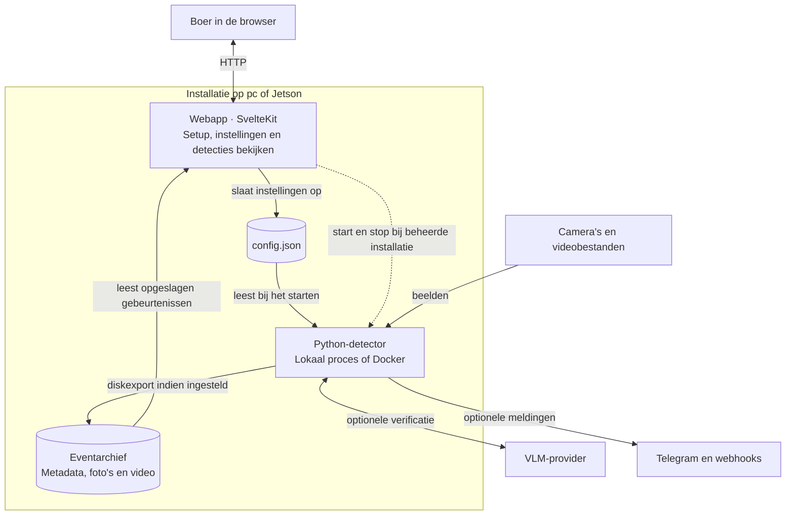
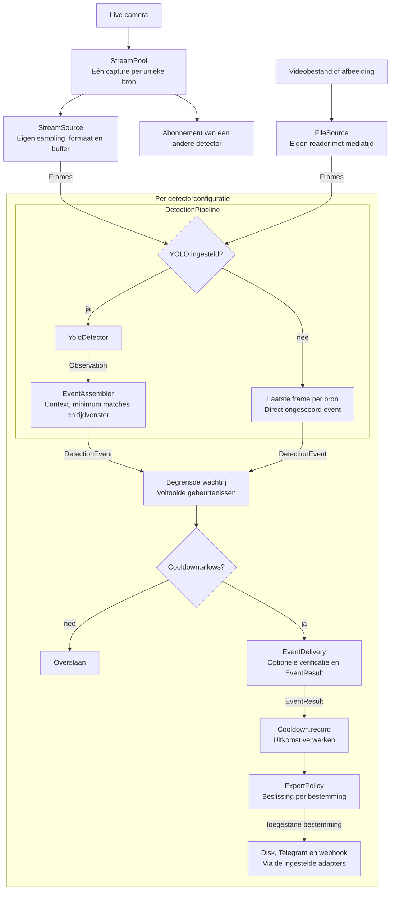
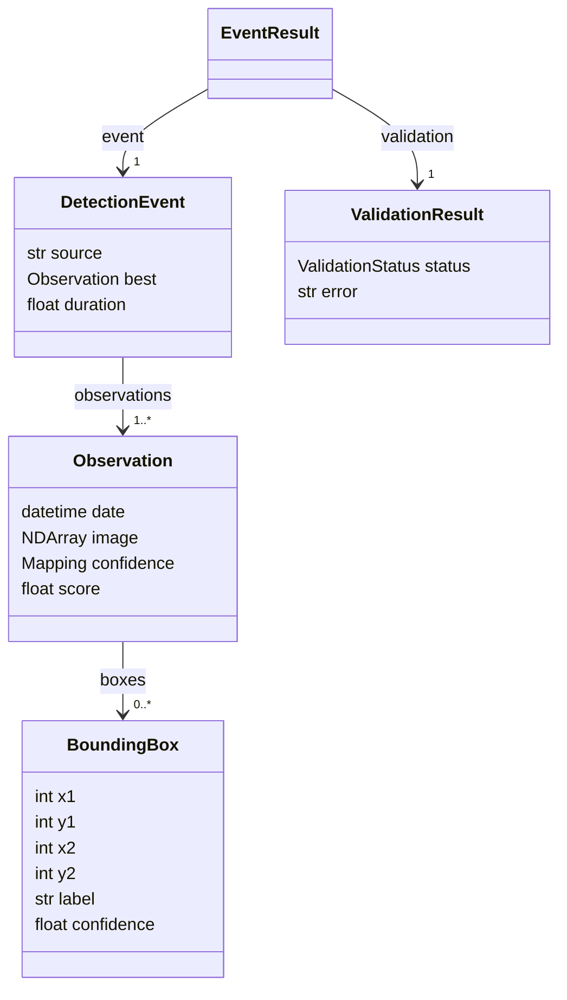
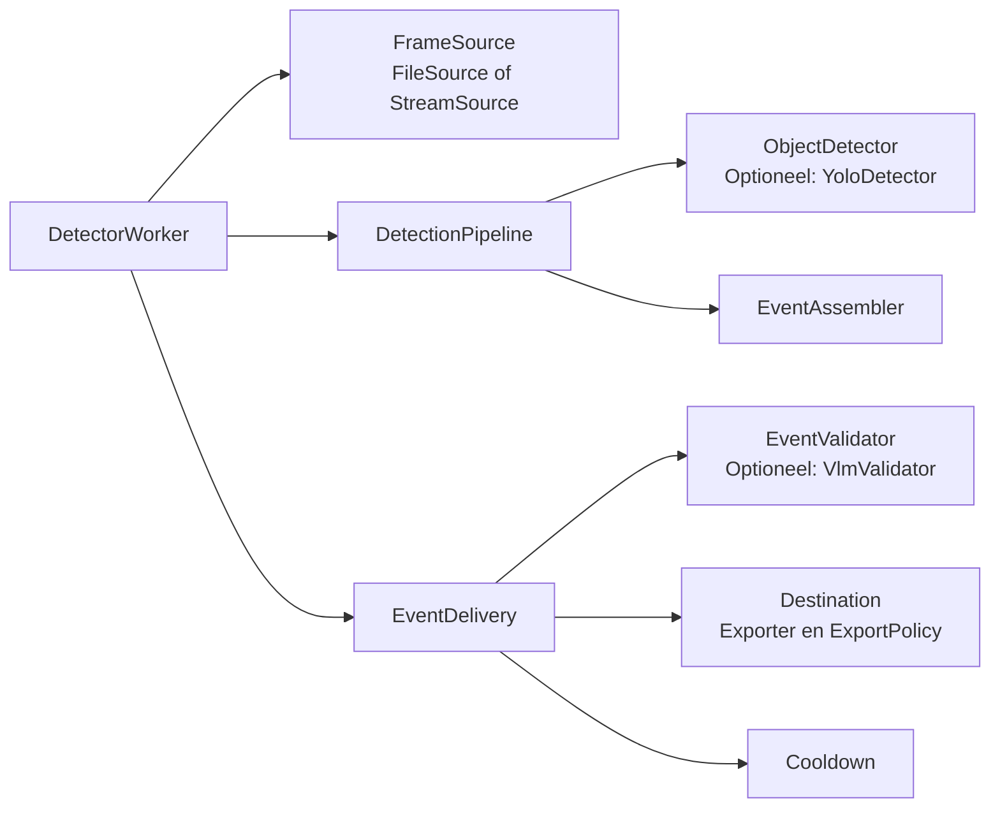

# Overzicht van AI Detector

Gebaseerd op de implementatie van 22 september 2026. Lees de diagrammen van buiten naar binnen: eerst de onderdelen, dan de verwerking van een camerabeeld, het domeinmodel en de verbindingen in de code. De namen in de diagrammen verwijzen naar bestaande code.

## 1. Welke onderdelen werken samen?

Deze systeemkaart volgt de aanpak van het [C4-model](https://c4model.com/): begin bij de gebruiker, de draaiende onderdelen en hun verbindingen. Een C4-container is bijvoorbeeld een webserver of detectorproces; dat hoeft geen Docker-container te zijn.

De doorgetrokken pijlen tonen gegevensuitwisseling; de stippellijn toont procesbeheer. De webapp leest het eventarchief rechtstreeks uit de gedeelde datamap. De detector levert hiervoor geen HTTP-API. De metadata en mediabestanden vormen het contract tussen beide onderdelen.

Er zijn twee manieren om deze onderdelen te draaien:

| Installatie | Wie start en stopt de detector? | Instellingen toepassen |
| --- | --- | --- |
| Complete applicatiedownload | De webapp via `ManagedDetector`; lokaal of via Docker | De actieve detector wordt bij opslaan opnieuw gestart. |
| Losse diensten met Compose, bijvoorbeeld op Jetson | Docker Compose en het ingestelde opstartgedrag | De detector moet na een configuratiewijziging worden herstart. |

Het sluiten van een browsertab stopt de verwerking niet. De details van installeren en automatisch starten staan in de [gebruikershandleiding](README.md).

De kaart toont de hoofdroute. De webapp heeft daarnaast een eigen FFmpeg-route voor livevoorbeelden van camerastreams. Die verbindingen vallen buiten de gedeelde cameraverbindingen van het Python-proces. Modeldownloads, healthchecks en applicatielabels zijn hier weggelaten om de hoofdroute leesbaar te houden.

## 2. Hoe wordt een camerabeeld een gebeurtenis?

Dit is de verwerkingsvolgorde binnen Python. Pijlen tonen gegevens en beslissingen, geen imports tussen modules.

`StreamPool` deelt livebeelden tussen detectoren binnen één Python-proces op basis van exact dezelfde bronstring. Iedere detector behoudt zijn eigen model, tracking, sampling, gebeurtenisvensters en cooldown. Bestandslezers blijven onafhankelijk.

`DetectionPipeline` maakt en beheert zijn eigen `EventAssembler` met een vast `EventPolicy`. Een gebeurtenis kan meerdere beelden bevatten, inclusief context zonder score. Alleen waarnemingen met passende class-scores tellen mee voor het minimumaantal matches. Het tijdvenster, inactiviteit, het einde van een bestand of afsluiten van de applicatie bepalen wanneer het event wordt afgerond. Zonder YOLO maakt de pipeline direct één ongescoord event met het laatste frame van elke bron; daarvoor is geen apart detectorobject nodig.

Elke detector heeft één eigenaar voor eventopbouw en één afzonderlijke delivery-thread. De begrensde wachtrij verbindt die twee. Die delivery-thread handelt verificatie en uitvoer op volgorde af en gebruikt de domeinregels voor cooldown en export.

| Verificatie-uitkomst | Verbruikt cooldown? | Uitvoer |
| --- | --- | --- |
| `APPROVED` | Ja | Volgens het beleid van elke bestemming. |
| `UNVALIDATED` | Ja | Verificatie is niet ingesteld; het normale uitvoerbeleid geldt. |
| `REJECTED` | Nee | Alleen naar bestemmingen die afgewezen events toestaan. |
| `FAILED` | Nee | Kan met foutinformatie worden gearchiveerd; geen gewone externe melding. |

Cooldown geldt per bron en class op de beste waarneming. Een event zonder class-scores heeft geen class-cooldown. Een mislukte bezorging draait de acceptatie niet terug. De confidencefilter van iedere bestemming blijft daarnaast van toepassing.

## 3. Wat betekenen de belangrijkste domeinobjecten?

Dit kleine UML-klassendiagram toont de relaties en een selectie van velden en afgeleide eigenschappen. Het is bedoeld om de taal van het systeem te begrijpen.

Een `Frame` is een beeld met een tijdstip, vóór inference. Een `Observation` voegt class-scores en eventuele bounding boxes toe. Contextbeelden kunnen geen scores hebben en wel boxes voor de weergave bevatten. `BoundingBox.label`, `BoundingBox.confidence` en `ValidationResult.error` zijn optioneel.

`DetectionEvent` bundelt de waarnemingen van één afgeronde gebeurtenis. `EventResult` koppelt dat event aan de verificatie-uitkomst. De resultaten van de daadwerkelijke bezorging staan afzonderlijk in `DeliveryReport` in de applicatielaag.

## 4. Hoe zijn de onderdelen in de code verbonden?

`run_application` bouwt per detectorconfiguratie een worker met een bron, pipeline en delivery. Dit diagram toont de belangrijkste objectverbindingen; de pijlen betekenen "gebruikt". De pipeline maakt zijn assembler zelf.

Model- en platformresources worden door twee contextfuncties beheerd. [`inference_runtime`](detector/src/aidetector/adapters/inference/onnx.py) beheert de providerbibliotheken en tijdelijke ONNX-instellingen voor de hele applicatie. [`open_detector`](detector/src/aidetector/adapters/inference/yolo.py) levert een gebruiksklare `YoloDetector` en ruimt predictor en trackingbeelden samen op. Bij afsluiten stopt eerst de verwerking, daarna sluiten de gedeelde captures, detectoren en platformresources.

De regels hebben deze eigenaren:

| Verantwoordelijkheid | Eigenaar in de code |
| --- | --- |
| Beginnen, verlengen en afsluiten van events | [`EventAssembler`](detector/src/aidetector/domain/events.py) |
| Cooldown en toelating per bestemming | [`Cooldown` en `ExportPolicy`](detector/src/aidetector/domain/policy.py) |
| Inference, eventopbouw en verwerking zonder YOLO | [`DetectionPipeline`](detector/src/aidetector/application/pipeline.py) |
| Verifiëren en bestemmingen afhandelen | [`EventDelivery`](detector/src/aidetector/application/delivery.py) |
| Threads, wachtrij, fouten en afsluiten | [`DetectorWorker` en `run_detectors`](detector/src/aidetector/runtime.py) |
| Configuratie omzetten in concrete onderdelen | [`run_application`](detector/src/aidetector/bootstrap.py) |

## Hoe lees je daarna de code?

Begin bij [bootstrap.py](detector/src/aidetector/bootstrap.py): daar wordt één configuratie omgezet in bronnen, modellen, policies, adapters en workers. Volg daarna `DetectionPipeline` en `EventDelivery`. Open pas een adapter wanneer je wilt weten hoe een specifieke integratie werkt.

De adapters besteden bestaande bibliotheekfuncties uit: Ultralytics verzorgt modeldownloads, boxlabels en de conversie van checkpointpaden; LiteLLM maakt het antwoordschema uit het Pydantic-model; Pydantic valideert HTTP-URL's. De detector behoudt zijn eigen eventregels en herstelt tijdelijke wijzigingen aan globale SDK-instellingen.

De afhankelijkheden wijzen naar binnen: de applicatielaag gebruikt domeinobjecten en kleine protocols. Adapters implementeren de integraties; bootstrap verbindt ze. Het domein importeert geen applicatieservices, configuratiemodellen of inferenceframeworks. Deze lagen vormen samen één model voor eventverwerking. De pakketten zijn geen afzonderlijke DDD-bounded contexts.

Binnen `adapters/` staan de bronlezers in `sources/`, modelintegraties in `inference/`, bestemmingen in `exporters/` en beeldbewerking in `media/`. Healthmonitoring, gedeeld HTTP-transport en VLM-verificatie blijven afzonderlijke modules. Importregels voorkomen dat bronnen, inference en exporters elkaar rechtstreeks of via andere modules gebruiken; bootstrap verbindt ze via de applicatielaag. De [pakketkaart](detector/ARCHITECTURE.md#dependency-direction) toont deze structuur en de gedeelde afhankelijkheden.

De [uitgebreide detectorarchitectuur](detector/ARCHITECTURE.md) beschrijft de precieze tijdregels, resource-eigenaren en foutafhandeling. De [review](detector/REVIEW.md) legt de gemaakte afwegingen vast.

## Bijhouden

De diagrammen staan als Mermaid-tekst naast de code. [GitHub rendert deze blokken in Markdown](https://docs.github.com/en/get-started/writing-on-github/working-with-advanced-formatting/creating-diagrams). Werk ze bij wanneer een procesgrens, publieke gegevensuitwisseling, domeinbegrip of belangrijke verwerkingsstap verandert. Kleine interne helpers hoeven niet in het overzicht.
