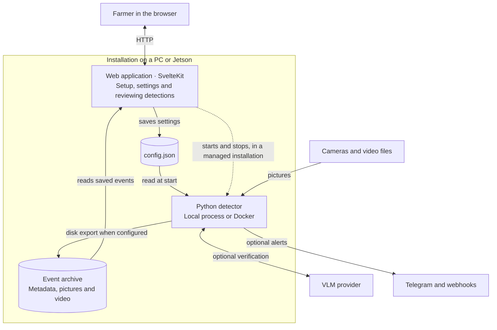
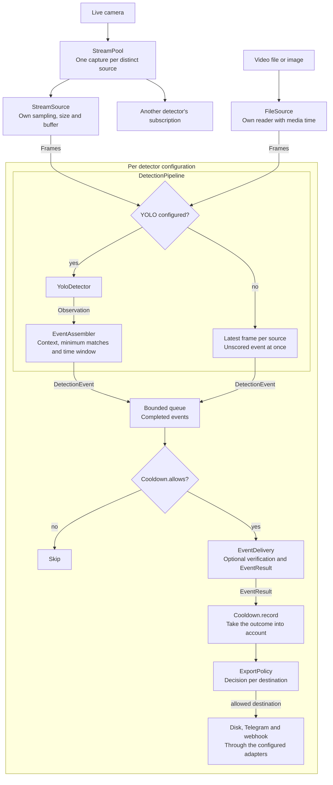
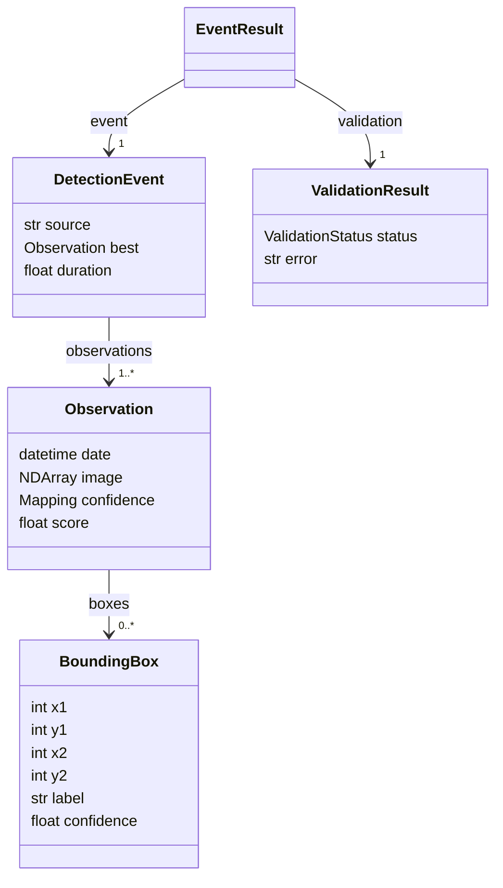
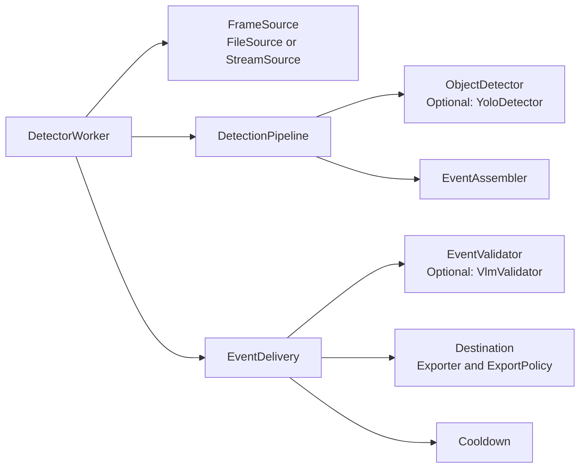

# AI Detector system overview

Read the diagrams from the outside in: first the parts, then how a camera picture becomes an event, the domain model, and how the code is connected. The names in the diagrams are names in the code.

## 1. Which parts work together?

This map follows the [C4 model](https://c4model.com/): start with the user, the running parts and their connections. A C4 container is a running program, such as a web server or the detector process; it need not be a Docker container.

```mermaid
flowchart TB
    User["Farmer in the browser"]
    Sources["Cameras and video files"]

    subgraph Installation["Installation on a PC or Jetson"]
        Web["Web application · SvelteKit<br/>Setup, settings and reviewing detections"]
        Config[("config.json")]
        Detector["Python detector<br/>Local process or Docker"]
        Archive[("Event archive<br/>Metadata, pictures and video")]

        Web -->|saves settings| Config
        Config -->|read at start| Detector
        Detector -->|disk export when configured| Archive
        Archive -->|reads saved events| Web
        Web -.->|starts and stops, in a managed installation| Detector
    end

    User <-->|HTTP| Web
    Sources -->|pictures| Detector
    Detector <-->|optional verification| VLM["VLM provider"]
    Detector -->|optional alerts| Destinations["Telegram and webhooks"]
```

Solid arrows are data; the dotted arrow is process control. The web application reads the event archive straight from the shared data folder. The detector offers no HTTP API: the metadata and media files are the contract between the two.

There are two ways to run these parts:

| Installation | Who starts and stops the detector? | Applying settings |
| --- | --- | --- |
| Complete application download | The web application, through `ManagedDetector`; locally or through Docker | The running detector is restarted when settings are saved. |
| Separate services with Compose, for example on a Jetson | Docker Compose and its restart policy | The detector must be restarted after a configuration change. |

Closing a browser tab does not stop processing. Installing and starting automatically are described in the [user guide](README.md).

The map shows the main route. The web application also has its own FFmpeg route for live camera pictures, separate from the camera connections of the Python process. Model downloads, health checks and the web application's own labels are left out to keep the map readable.

## 2. How does a camera picture become an event?

This is the order of processing inside Python. Arrows are data and decisions, not imports between modules.

```mermaid
flowchart TB
    Camera["Live camera"] --> Pool["StreamPool<br/>One capture per distinct source"]
    Pool --> Subscription["StreamSource<br/>Own sampling, size and buffer"]
    Pool --> Other["Another detector's subscription"]
    File["Video file or image"] --> FileSource["FileSource<br/>Own reader with media time"]

    subgraph Worker["Per detector configuration"]
        subgraph Pipeline["DetectionPipeline"]
            Mode{"YOLO configured?"}
            Inference["YoloDetector"]
            Events["EventAssembler<br/>Context, minimum matches and time window"]
            Snapshot["Latest frame per source<br/>Unscored event at once"]
            Mode -->|yes| Inference
            Inference -->|Observation| Events
            Mode -->|no| Snapshot
        end
        Queue["Bounded queue<br/>Completed events"]
        Allowed{"Cooldown.allows?"}
        Skip["Skip"]
        Verify["EventDelivery<br/>Optional verification and EventResult"]
        Record["Cooldown.record<br/>Take the outcome into account"]
        Policy["ExportPolicy<br/>Decision per destination"]
        Export["Disk, Telegram and webhook<br/>Through the configured adapters"]

        Events -->|DetectionEvent| Queue
        Snapshot -->|DetectionEvent| Queue
        Queue --> Allowed
        Allowed -->|no| Skip
        Allowed -->|yes| Verify
        Verify -->|EventResult| Record
        Record --> Policy
        Policy -->|allowed destination| Export
    end

    Subscription -->|Frames| Mode
    FileSource -->|Frames| Mode
```

`StreamPool` shares live pictures between detectors in one Python process, by exactly the same source string. Each detector keeps its own model, tracking, sampling, event windows and cooldown. File readers stay independent.

`DetectionPipeline` creates and owns its `EventAssembler`, with a fixed `EventPolicy`. An event can hold several pictures, including context without a score. Only observations with matching class scores count toward the minimum number of matches. The time window, inactivity, the end of a file or shutting down decide when the event is completed. Without YOLO the pipeline makes one unscored event from the latest frame of each source.

Each detector has one owner for assembling events and one separate delivery thread, joined by the bounded queue. The delivery thread handles verification and output in order, using the domain rules for cooldown and export.

| Verification outcome | Consumes cooldown? | Output |
| --- | --- | --- |
| `APPROVED` | Yes | According to each destination's policy. |
| `UNVALIDATED` | Yes | No verification is configured; the normal output policy applies. |
| `REJECTED` | No | Only to destinations that accept rejected events. |
| `FAILED` | No | May be archived with the error; no ordinary external alert. |

Cooldown is kept per source and class, on the best observation. An event without class scores has no class cooldown. A failed delivery does not undo acceptance. Each destination's confidence filter still applies.

## 3. What do the main domain objects mean?

This small class diagram shows the relations and a selection of fields and derived properties. It is meant for learning the language of the system.

```mermaid
classDiagram
    direction TB

    class EventResult
    class DetectionEvent {
        str source
        Observation best
        float duration
    }
    class Observation {
        datetime date
        NDArray image
        Mapping confidence
        float score
    }
    class BoundingBox {
        int x1
        int y1
        int x2
        int y2
        str label
        float confidence
    }
    class ValidationResult {
        ValidationStatus status
        str error
    }

    EventResult --> "1" DetectionEvent : event
    EventResult --> "1" ValidationResult : validation
    DetectionEvent --> "1..*" Observation : observations
    Observation --> "0..*" BoundingBox : boxes
```

A `Frame` is a picture with a time, before inference. An `Observation` adds class scores and possibly bounding boxes. Context pictures can have no scores and still carry boxes for display. `BoundingBox.label`, `BoundingBox.confidence` and `ValidationResult.error` are optional.

`DetectionEvent` bundles the observations of one completed event. `EventResult` joins that event to its verification outcome. What actually happened during delivery is kept separately, in the application layer's `DeliveryReport`.

## 4. How are the parts connected in the code?

`run_application` builds one worker per detector configuration, with a source, a pipeline and a delivery. The arrows mean "uses". The pipeline creates its own assembler.

```mermaid
flowchart LR
    Worker["DetectorWorker"] --> Source["FrameSource<br/>FileSource or StreamSource"]
    Worker --> Pipeline["DetectionPipeline"]
    Worker --> Delivery["EventDelivery"]
    Pipeline --> Detector["ObjectDetector<br/>Optional: YoloDetector"]
    Pipeline --> Assembler["EventAssembler"]
    Delivery --> Validator["EventValidator<br/>Optional: VlmValidator"]
    Delivery --> Destinations["Destination<br/>Exporter and ExportPolicy"]
    Delivery --> Cooldown["Cooldown"]
```

Model and platform resources are managed by two context functions. [`inference_runtime`](detector/src/aidetector/adapters/inference/onnx.py) manages the provider libraries and temporary ONNX settings for the whole application. [`open_detector`](detector/src/aidetector/adapters/inference/yolo.py) yields a ready `YoloDetector` and releases its predictor and tracking pictures together. At shutdown, processing stops first; then the shared captures, the detectors and the platform resources close.

Each rule has one owner:

| Responsibility | Owner in the code |
| --- | --- |
| Starting, extending and closing events | [`EventAssembler`](detector/src/aidetector/domain/events.py) |
| Cooldown, and admission per destination | [`Cooldown` and `ExportPolicy`](detector/src/aidetector/domain/policy.py) |
| Inference, event assembly, and processing without YOLO | [`DetectionPipeline`](detector/src/aidetector/application/pipeline.py) |
| Verifying, and handling destinations | [`EventDelivery`](detector/src/aidetector/application/delivery.py) |
| Threads, queue, failures and shutdown | [`DetectorWorker` and `run_detectors`](detector/src/aidetector/runtime.py) |
| Turning configuration into concrete parts | [`run_application`](detector/src/aidetector/bootstrap.py) |

## Reading the code from here

Start at [bootstrap.py](detector/src/aidetector/bootstrap.py), where one configuration becomes sources, models, policies, adapters and workers. Then follow `DetectionPipeline` and `EventDelivery`. Open an adapter only when you want to know how one integration works.

Dependencies point inward: the application layer uses domain objects and small protocols; adapters implement the integrations; bootstrap connects them. The domain imports no application services, configuration models or inference frameworks. Import rules also keep sources, inference and exporters from using one another; the [package map](detector/ARCHITECTURE.md#dependency-direction) shows that structure. Together the layers are one model of event processing, not separate bounded contexts.

The [detector architecture](detector/ARCHITECTURE.md) has the exact time rules, the resource owners and the failure handling.

## Keeping this up to date

The diagrams are Mermaid text beside the code, and [GitHub renders them](https://docs.github.com/en/get-started/writing-on-github/working-with-advanced-formatting/creating-diagrams). Update them when a process boundary, a public data exchange, a domain concept or an important processing step changes. Small internal helpers do not belong in the overview.
