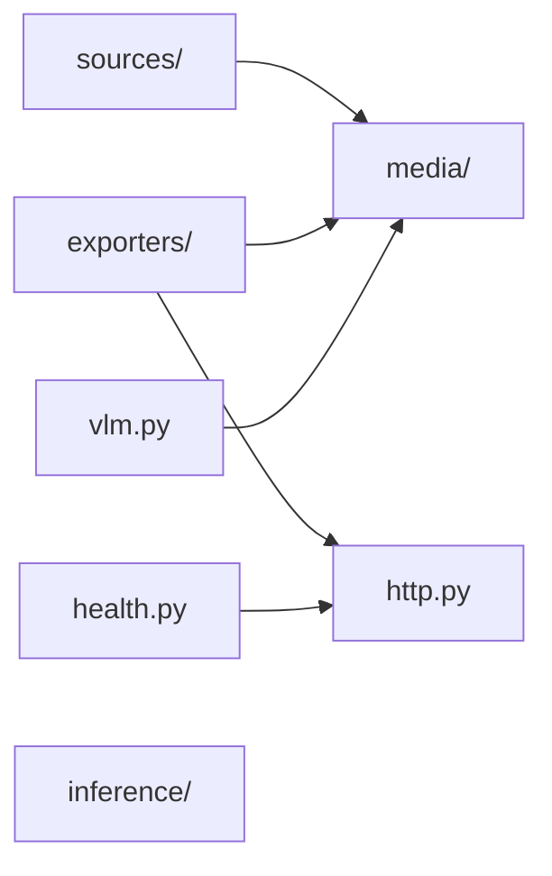

# Detector architecture

## Scope and purpose

The current rebuild covers the Python application only. It watches video sources, groups object observations into events, optionally verifies an event with a vision language model, and archives or delivers the result. Python, Ultralytics, LiteLLM, OpenCV, Pydantic, and the existing distribution targets remain appropriate tools.

The architecture isolates event decisions from I/O. Its dependency direction follows Robert Martin's [Clean Architecture dependency rule](https://blog.cleancoder.com/uncle-bob/2012/08/13/the-clean-architecture.html). Protocols correspond to current I/O boundaries; ordinary functions and dataclasses implement the event rules.

This is a small hexagonal architecture: application use cases define the operations and the ports they need; adapters provide the concrete I/O. `DetectionPipeline.process` and `EventDelivery.deliver` are use-case entrypoints called by the runtime. Outgoing ports live in `application/ports.py`, close to their consumers. Dependency inversion comes from those contracts and explicit construction, rather than an injection framework or an interface for every class.

Domain decisions perform no I/O and receive time from their caller. `EventAssembler` and `Cooldown` own deterministic state transitions, so the domain is not entirely stateless. Borrowed image arrays are data, not an invitation to run inference or rendering in this layer. Keeping these responsibilities visible matters more than adding packages named after every architectural term.

Image fields use `NDArray[np.uint8]` annotations under `TYPE_CHECKING`. This is a deliberate static dependency on the image representation, allowed only from `domain.models` by the core dependency check. The domain loads no NumPy and never operates on pixels. Retaining useful type information is preferable here to untyped payloads or a generic image abstraction.

## Dependency direction

```text
cli -> bootstrap -> runtime + concrete adapters
                       |
                       v
                  application -> domain
                       ^            ^
                       |            |
                    adapters -------+
```

- `domain`: frozen observation/event records, confidence rules, event windows, cooldown decisions, and validation outcomes. An observation carries its timestamp, image reference, bounding boxes, and class scores. Arrays and score mappings are treated as read-only; freezing a record does not deep-copy them. Importing this package must not load NumPy, Torch, OpenCV, or an inference runtime.
- `application`: coordinates inference, event aggregation, validation, and exports through narrow protocols. `DetectionPipeline` owns its assembler; `EventDelivery` applies verification and delivery rules in order.
- `adapters`: video input, YOLO, VLM requests, image/video encoding, event files, HTTP/Telegram, health pings, and platform inference setup.
- `configuration`: Pydantic input models, normalization, file loading, and schema production. These are boundary concerns. Models do not inspect hardware or load a local file at import time.
- `runtime`: owns execution and supervision of detectors and the optional health monitor; one aggregation owner per detector and one ordered delivery worker per detector.
- `bootstrap`: translates validated configuration into domain policies and constructs integrations. No container or automatic registration.
- `cli`: argument parsing, logging, config errors, signal handling, and exit status. Importing it is safe.

Within `adapters`, folders group integrations by responsibility:

```text
adapters/
├── exporters/             # Detection-event destinations
│   ├── disk.py
│   ├── archive_metadata.py
│   ├── telegram.py
│   └── webhook.py
├── sources/               # Frame acquisition
│   ├── files.py
│   └── streams.py
├── inference/             # Model assets, ONNX providers and YOLO
├── media/                 # Images, video and event attachments
├── health.py              # Periodic monitoring, supervised by runtime
├── http.py                # Transport shared by exporters and health
└── vlm.py                 # Event verification
```

Exporters, sources and inference do not import one another, directly or indirectly. Bootstrap connects them through application ports. Media operations and HTTP transport are shared where needed; health monitoring has a separate lifecycle from event delivery. Archive metadata belongs beside the disk exporter because it defines the web application's public archive format.

This diagram shows the internal imports shared by adapter groups; it omits their inward dependencies on application/domain types and configuration:



Package initializers do not import their children or expose alternate import paths; callers import the module that owns an operation. `media.MediaError` is the shared encoding failure contract.

An architecture test compares every source module on disk with the import graph. A missing `__init__.py` cannot silently exclude a new directory from the dependency checks. A copied-source regression verifies that restoring the initializer exposes a previously hidden forbidden import.

Provider setup receives `OnnxConfig` and immutable `ModelRequirements(path, image_size, batch_size)` inputs projected by bootstrap. ONNX code does not traverse application-wide detector, event or exporter configuration. Provider-specific TensorRT profiles remain inside the adapter.

The declarative [.importlinter](.importlinter) contracts enforce exhaustive layers, forbidden dependencies, adapter-group independence and sibling acyclicity. Grimp supplies the import graph, including function-local imports; additional tests retain the domain/application dependency allowlists and check cycles involving package initializers. These structural checks include type-checking-only imports, so annotations cannot bypass dependency direction. The sole external core type allowance is NumPy in `domain.models`; the isolated runtime import probe still requires the domain to load without any third-party package. These rules establish structural conformance, not the suitability of every responsibility boundary.

Child-process probes verify selected domain, application, runtime and CLI imports without creating application files, reading configuration, using sockets, spawning processes or starting threads. They also detect logging changes and unintended inference imports. The child installs its own guards and retains evidence when a module swallows a guard exception. Interpreter code and package metadata reads remain allowed. This is a regression check for observed Python operations, not a sandbox for arbitrary native code. Negative probes exercise the prohibited operations; see [QUALITY.md](QUALITY.md) for scope and interpretation.

Model paths and the application cache belong to `adapters/inference/model_assets.py`. Stock model names retain Ultralytics' automatic asset download; explicit model URLs use its `safe_download` utility. The SDK import is deferred until a URL actually needs downloading, keeping module imports and offline path resolution free of inference setup. `adapters/media/images.py` contains image operations, while `adapters/media/video.py` owns raw-video staging, encoding attempts, FFmpeg execution, and temporary-file cleanup. ONNX provider selection is a deterministic operation; SDK registration and session construction remain in the lifetime-managed adapter.

## Domain boundary and language

The Python detector has one event-processing model: turn footage from a source into a completed event, obtain its verification outcome, and apply cooldown and export policies. Treat this as one bounded context. The domain, application and adapter packages are layers within that context. Capture, inference and delivery are integrations with different technical responsibilities; they do not each need another domain model or service.

This vocabulary describes the implemented behavior and is used in code and tests. It is a working model to refine with farmers as their use cases develop; it has not been validated as their preferred terminology.

| Term | Meaning in this detector |
| --- | --- |
| Source | The configured identity of a camera, stream or file. Event windows and cooldown entries stay separate by source. |
| `Frame` | An acquired image and its source timestamp, before inference. |
| `Observation` | A frame with matching class scores and optional display boxes. It may be an unscored context frame. |
| Qualifying observation | An observation with a nonempty confidence map after the detector's class thresholds have been applied. Only these count toward `EventPolicy.min_frames` (`frames_min` in configuration). |
| `BoundingBox` | Image coordinates with an optional label and score. `Observation.enclosing_box` encloses its boxes. A cropped image is a separate media result produced by an adapter. |
| Event window | The assembler's mutable, per-source collection of observations and match timing while an event is active. |
| `DetectionEvent` | A completed, nonempty sequence of observations from one source, ordered by source time. Its best observation has the highest matching class score; ties keep the first. |
| `ValidationResult` | The explicit approved, rejected, unvalidated or failed verification outcome. |
| `EventResult` | A completed event paired with its verification outcome. Delivery successes and failures belong to the application's `DeliveryReport`. |
| Cooldown | The interval since an accepted event's best observation, tracked per source and class within one detector. |

Context observations may carry display boxes propagated from a scored frame. Boxes alone do not make a frame qualify. Without object detection, `DetectionPipeline` directly emits one unscored event containing the latest frame of each source batch. No separate passthrough detector or nullable event policy is needed.

`DetectionPipeline` creates an `EventAssembler` from an immutable `EventPolicy`. The assembler owns changes to active windows and emits completed records; it always has a real policy. `Cooldown` owns whether a verification outcome consumes the interval, and `ExportPolicy` owns eligibility for an individual destination. The application invokes these rules in order; adapters translate SDK responses and perform I/O. These responsibilities fit ordinary records and policy objects. There is no current need for a repository, aggregate base class or domain-event bus.

Source and inference adapters supply nonempty, ordered per-source batches. The assembler establishes completed-event invariants. Domain consumers rely on those producer contracts rather than repeatedly validating or copying internal data. Frozen records borrow image arrays and confidence mappings as read-only values; adapters must preserve that ownership contract.

Images are `uint8` H×W×3 arrays in BGR channel order. `Frame` and `Observation` document this representation, and `DetectionEvent` documents its nonempty, chronological observations. These are producer obligations, not additional validation at every consumer.

The archive is a public projection consumed by the web app. `EventMetadata.from_result` deliberately retains the legacy `detections` field as the number of observations, including context, and `crop` as the best observation's enclosing box. Archive timestamps, directory stages and transport field names remain adapter concerns. Internal terminology can improve without requiring existing archives or web readers to migrate.

## Event semantics

Each observation has its source timestamp, image, boxes, and matching class scores. A batch may include context frames without scores. Inference scores only the latest frame in an ordinary source batch; tracking keeps stable source slots when a camera is temporarily absent.

An event begins with a qualifying observation and can include preceding context from that batch. `frames_min` counts observations with scores, not context frames. This preserves the implemented meaning rather than the old README's inaccurate claim that they must be consecutive.

An event closes when its maximum duration is reached, its inactivity timeout expires, the source reaches EOF, or shutdown drains the detector. Finite sources explicitly report completion. An eligible event is completed and queued for delivery before reading the next file; the separate delivery worker may finish exporting it later. Trailing frames are included only within the configured trailing duration after the last qualifying observation. Timestamp boundaries use an explicit, documented comparison and can be tested without sleeping.

Buffered observations are consumed in timestamp order. Eligible trailing frames before a boundary stay with the closing event, and the observation at the boundary is processed after that event closes. A batch can refresh the inactivity deadline or span multiple event windows.

Source state never crosses source identities. Finite video timestamps follow video position, so grouping is independent of machine/inference speed. Live source timestamps follow capture time. Files and live streams belong in separate detector definitions when their scheduling requirements differ.

`SourceBatch.advance_to` optionally advances the event clock after the batch's frames are processed. Live subscriptions supply their newest retained frame time, or wall time for an empty heartbeat, so idle events can expire. Finite files omit it and advance through media timestamps. The field is not the acquisition timestamp of every image or a guarantee about future frame ordering.

Cooldowns are per source and class. The ordered delivery worker evaluates cooldown before validation and passes every `EventResult` to `Cooldown.record`. The domain records approval or intentionally unvalidated processing; rejection and validation failure leave the previous acceptance time unchanged. At least one class on the best observation must be outside its cooldown for an event to proceed; acceptance then records every class on that observation. Unscored events have no class cooldown. Checking and recording in the same worker prevents concurrent events from both bypassing it.

Cooldown consumption, destination eligibility and successful delivery are separate decisions. An exporter failure or a destination's confidence filter does not undo acceptance. This preserves the configured alert cadence even when an external destination is unavailable.

## Validation and delivery

Validation has four explicit outcomes: approved, rejected, not configured, and failed. The disk adapter owns the projection onto the public `approved`, `rejected`, and `unvalidated` directories; the domain does not choose archive paths. Failed validation can be archived as `unvalidated` with an explicit error field. A configured verifier failing must not produce an ordinary unvalidated external notification.

Provider fallback is finite and applies to documented provider errors or invalid provider output. Media preparation belongs to each verifier configuration: an encoding failure skips that configuration and allows the next strategy to run. Exhausting all configurations remains failed validation. A successful negative answer is a rejection, not a reason to ask the next model. Provider requests have a timeout. No real provider is contacted by the automated test suite.

The response parser translates empty choices, missing answer text, and invalid structured content into `InvalidAnswer`. Only provider errors and that explicit parsing failure participate in model fallback. An unexpected `IndexError` or `ValueError` from the SDK is allowed to reach supervision; a programming defect must not be misreported as unavailable verification.

The requested provider response contains exactly one required Boolean field, `detected`. The Pydantic answer model is passed directly to LiteLLM, which constructs the provider's structured-response schema. The same model validates the returned JSON. Boolean strings, numbers, missing fields and additional properties are invalid answers. Real model accuracy under the smaller response schema must be evaluated with the selected provider and labeled footage; local contract tests establish parsing and fallback behavior.

`EventDelivery` evaluates each destination's `ExportPolicy` before calling its exporter. Confidence/rejection filtering belongs to that policy; calling an adapter directly bypasses those decisions. One destination failing does not prevent independent destinations from being attempted. Delivery failures are recorded in the worker result/log and are not reported as successful delivery. Telegram composes the same rendered media as webhook delivery without inheriting an unrelated transport's behavior.

Media is encoded once per requested variant. Separate image/video caches use named, immutable keys. Image keys include crop padding and crop annotation only for cropped images, so those options do not trigger re-encoding of original or annotated images. Internal variants are `original`, `annotated` and `crop`; attachments retain the public `image`, `photo` and `crop` names. Compatible video variants are reused when a destination's size cap permits. Both caches are cleared when their event is released or delivery moves to another event. Video encoding handles equal timestamps, subprocess failures, and output limits explicitly. It writes processed frames incrementally to temporary input rather than keeping another full clip of plotted arrays in memory. Disk events have unique directories and become visible to readers only after their metadata and media are complete.

Cropping prefers the requested aspect ratio while preserving the detected region. If the source image cannot contain both that region and the preferred ratio, its bounds take precedence. Ultralytics' OpenCV `Annotator` draws boxes and labels on a copy; the adapter supplies clipped coordinates and label text. Raw input pixels are never modified by overlays.

Missing FFmpeg and OpenCV JPEG codec failures are media failures at their encoding boundaries; verification and delivery translate it into their existing failure outcomes. Telegram caps photos at 10 MB and videos at 12 MB. Webhooks apply their configured attachment limit to both media types.

## Configuration and ownership

`config.json` remains the public entrypoint and accepts existing scalar-or-list source, verifier, and exporter fields. The boundary normalizes these representations once. Reading or validating config never rewrites the user's file. Bootstrap owns the resolved data directory; adapters do not depend on changing the process working directory.

`SourceConfig` describes acquisition and sampling; `DetectorConfig` composes those settings with inference, verification and exporters. `TelegramConfig` describes the Telegram destination. These Python names appear in the generated schema's definitions; the public `detection` and `telegram` configuration keys retain their existing spelling.

Bootstrap passes only `SourceConfig` to `build_source` and `ExportersConfig` to `build_destinations`. Those helpers do not need access to the rest of the detector settings.

Defaults are deterministic. Invalid bounds, empty source/model lists, misspelled options, and invalid class maps are configuration errors. Configuration also owns source syntax and the finite/live distinction. The shared classifier is pure; bootstrap selects the appropriate source adapter from already-validated groups. Unsupported protocols, missing hosts, HTTP images, and mixed finite/live groups fail the offline config check. File existence and camera availability remain runtime concerns. Secrets are excluded from configuration reprs and logs. Schema generation uses the actual detector metadata model, not a provider SDK's unrelated Metadata type.

Health and webhook destinations use Pydantic's strict `AnyHttpUrl` validation at this boundary. Malformed schemes, hosts, ports and URLs that need repair are rejected with a static diagnostic. The validated input string is retained, including credentials, IPv6 literals, encoded queries and fragments; URL normalization does not rewrite it.

Disk categories are single directory names, validated by the same constraint in Python and the generated JSON schema. This preserves the web reader's `detections/<category>/<stage>/<timestamp>/` layout.

## Resource ownership

The runtime owns detector workers and their shutdown signal. Bootstrap owns one `StreamPool` per application run. It registers every detector's live-source subscription before opening any captures, then opens one acquisition thread and capture handle per distinct source string. The pool closes before model/provider teardown, including when runtime startup fails. Finite file readers remain independent because they advance according to each detector's processing and media time.

Each live `StreamSource` is a detector's subscription. It owns its sampling interval, size limit, and bounded unread frame buffers, independently for each camera. Acquisition timestamps and decoded pixels are shared; resizing belongs to the subscription and published arrays are read-only. Reading one subscription never consumes another's frames. A slow detector drops its oldest unread frames instead of blocking acquisition on inference or delivery. Closing a subscription wakes its reader and clears its buffers without closing other subscriptions' cameras. The pool releases all captures when the application run ends. Expected disconnections reconnect once per camera; an unexpected capture failure reaches every affected subscription and the runtime supervisor. Sharing is within one process and uses exact configured source strings; URL aliases and separate processes are not coalesced.

A detector's pipeline owns event assembly; its YOLO adapter owns tracking state. A bounded delivery queue applies backpressure instead of retaining an unbounded number of image sequences. The delivery worker owns cooldown state and outbound sequencing. Workers release completed event references before blocking for more work. The shared media cache weakly references its event and drops encodings when that event is released. Encoding owns its subprocess and temporary files.

Bootstrap gives workers a diagnostic name from configuration order (`detector-1`, `detector-2`, and so on). Processing and delivery threads carry that name, and the CLI includes the thread name in each log line. A worker restores its caller's thread name on exit, including failure. Shared capture/health work retains a separate identity because it does not belong to one detector.

Bootstrap enters `inference_runtime` once per application run, then `open_detector` for each configured YOLO model. These context functions own resources in lexical cleanup scopes. `open_detector` yields a ready `YoloDetector` and releases both its predictor and tracking-frame cache; bootstrap never constructs or separately closes the raw SDK model. Class-validation and later startup failures release the predictor before `inference_runtime` restores session hooks, environment and provider libraries. Export-only Torch weights are released when the exported model replaces them, before inference starts. Selected precision applies to export and predictor construction through the SDK's `quantize` option.

Expected live-source failures reconnect with an interruptible delay. Invalid config and programming errors do not enter an endless restart loop. Source failure, delivery failure, and intentional user shutdown are distinguishable. The supervisor observes delivery results during signal-driven draining as well. Health pings stop with the detector, including when finite inputs end normally; unexpected health-worker errors reach the supervisor.

The health adapter performs timed HTTP requests and supports a stop signal through the small `HealthMonitor` port. It does not create a thread or call back into detector shutdown. The runtime executes it alongside the detector workers, observes its future, and stops it after the last finite detector finishes. A shared cleanup scope attempts every registered stop operation before joining the executor, including on signals and failures. One failed stop cannot prevent stop requests to the other tasks. Bootstrap only constructs the monitor and supplies it to the runtime.

Capture startup is inside the pool's cleanup scope: if starting a later thread fails, the already-started threads are stopped and joined. Each capture and detector worker logs its unexpected failure before propagating it. The supervisor still stops on the first failure, while diagnostics from concurrently failing workers remain available.

## Verification

1. Unit tests for domain boundaries, per-source isolation, confidence maps, cooldowns, EOF, and validation outcomes.
2. Contract tests for legacy config representations, generated schemas, disk metadata/stages, webhook bodies, Telegram methods/media, and provider parsing.
3. Runtime tests for bounded queues, failure propagation, draining, resource cleanup, health monitoring through EOF/signals, and continued shutdown when a source cannot close. An unhandled thread exception fails the test suite.
4. A local reference flow that reads a generated video, runs deterministic inference/verification, writes real JPEG/MP4 files, and validates their metadata. A generated ONNX graph exercises real Ultralytics tracking and session lifecycle without downloading weights.
5. Ruff, format, ty, import architecture checks, package build, CLI smoke checks, and distribution configuration review.
6. Baseline and replacement measurements using the same local input; distinguish inference startup from steady-state processing. Hardware-specific providers require the corresponding platform and must not be described as locally verified on macOS.
7. Built-executable smoke tests with a generated ONNX graph and an untrained Torch checkpoint, two sources, a local fake AI/HTTP server, real encoders, archives, health monitoring, and normal EOF shutdown. The ONNX variant checks tracking; the checkpoint variant checks the distribution's load/export path. Release builds run both before artifact publication.

## Third-party integration decisions

Model URL transfers use Ultralytics' downloader, including its transfer/completeness checks, rather than an application HTTP read loop. The application retains URL-specific cache directories and promotes a completed temporary file atomically. URL transfers make one SDK attempt with progress disabled; disabling retries prevents its curl fallback from exposing URLs through subprocess stderr. SDK log output is suppressed only on the downloading thread and failures become credential-free application errors; unrelated threads keep their diagnostics. A missing output after the SDK rejects an empty or partial response is a failed download. Transfer timeouts follow the installed SDK; its helper does not expose the previous custom downloader's 30-second timeout parameter.

Ultralytics inference setup is confined to the YOLO adapter. The predictor is prepared once because querying exported model names otherwise creates a disposable second ONNX session. A real ONNX integration test detects this duplicate-loading regression. Tracking uses the library's in-memory stream loader contract and a fixed source order. Result mapping is a plain function of the SDK response, frames and resolved class thresholds; the detector alone owns that configuration and its tracking state. The SDK's minimum inference threshold is derived from the resolved classes inside this adapter.

Ultralytics also handles cross-platform paths inside Torch checkpoints. The adapter restores both `pathlib.WindowsPath` and `pathlib.PosixPath` after model preparation because the SDK can leave those globals patched. It does not duplicate the SDK's conversion.

`inference_runtime` temporarily wraps the ONNX session factory because Ultralytics does not expose the required Windows ML device/session options. Its cleanup scope restores the factory and environment on normal exit and startup failure. Model predictors are released before execution-provider libraries are unregistered. CUDA DLL preloading and optional Windows SDK imports stay in this boundary.

The runtime lockfile is authoritative for development/test environments. Direct application dependencies are declared explicitly; platform extras provide one ONNX implementation each. The source distribution has an explicit file list to prevent local research data, recordings, model weights, and virtual environments from entering packages.

The complete maintainability review, completed changes, and retained tradeoffs are in [REVIEW.md](REVIEW.md). Enforced limits and current measurements are in [QUALITY.md](QUALITY.md).

## Desktop application integration

The web application can now launch the native detector or a matching NVIDIA container. This integration remains outside the detector's domain and application layers. The CLI's optional `--control-stdin` reader translates `stop` or EOF into a threading event, passed explicitly through bootstrap to runtime. Runtime observes it alongside the detector/health futures, then uses the existing stop-and-drain path. The daemon input reader cannot keep a completed finite job alive. Signals and ordinary standalone execution retain their behavior. The configuration and archive formats are unchanged.
