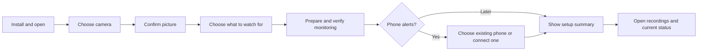

# Onboarding reassessment

Historical assessment: source paths, measurements and recommendations describe the recorded snapshot. Start with the [current contributor guide](../../../CONTRIBUTING.md) for the maintained implementation.

Historical onboarding assessment. Desktop updates and their installer/runtime follow-up are now implemented; see [the current distribution guide](../../../distribution/README.md) for build commands, behaviour and remaining OS qualification.


Assessment date: 22 September 2026. The assessment below reviewed the working tree after the first onboarding implementation recorded in [ONBOARDING_PLAN.md](PLAN.md). The follow-up ledger distinguishes subsequent implementation from the remaining roadmap; it does not claim a published, qualified release.

## Follow-up implementation

The local onboarding improvements are now implemented in source:

- Dashboard status becomes unavailable on failed refresh or after ten seconds without a successful check. Externally managed detectors are not labeled paused without evidence.
- Camera alert setup offers existing recipients first. Renaming or assigning an unchanged connection does not require another test; changed credentials still require confirmation.
- Telegram setup provides the prepared BotFather link, a copy fallback, token identity validation, a locally generated QR/link, automatic private-chat matching and the explicit test/receipt step. Sessions expire, cancel and isolate concurrent consumers. Existing webhooks are not changed; manual/group setup remains available.
- Camera discovery is the primary path, manual address entry is revealed on request, and safe connection metadata supports later changes.
- Setup progress persists per camera, including picture confirmation, a recording-location test and an explicit alert choice. Finishing checks current monitoring and binds completion to the current rules. The initial camera clip is reused where available; resumed checks can capture another clip.
- Model setup reports download, conversion and loading stages. Expected download failures preserve actionable retry guidance after exit, while the SDK downloader and prepared-model cache remain unchanged.

The recording-location test proves that its temporary clip can be written and decoded there. It does not fabricate an animal event or prove every future exporter publication, detection accuracy or hardware capacity. A dynamic category tests the archive root; actual per-event recording failures remain visible separately.

Still outside this implementation: managed/shared hosted bots, ongoing delivery-health UI, storage retention, backup/restore, in-app updates, sleep inhibition, full localization, a public download selector, signed-release qualification and a farmer-ready Jetson image. Real Telegram client/device acceptance and observed novice-user testing also remain necessary.

## Follow-up verification

Verified locally on macOS ARM64 on 22 September 2026:

- All 421 Python tests passed, including local media, model preparation and download failure behavior. Ruff, formatting, source/tool type checking, schema generation and all five import contracts passed.
- All 168 web tests and five production HTTP tests passed. Production checks cover camera recording verification through local, LAN and HTTPS origin handling. Svelte checking, ESLint, formatting and dependency rules passed.
- Browser checks used Playwright CLI because the Browser plugin was unavailable. They exercised the production Node server, temporary configuration, a synthetic ONVIF camera with real FFmpeg clips, a fixture detector and intercepted Telegram responses. No real camera credentials or Telegram messages were used.
- The browser journey covered invalid token recovery, BotFather draft links, QR pairing, matching the intended phone, test receipt confirmation, saved success, setup completion and app restart. A second camera reused and renamed the existing recipient while preserving the first camera's assignment, without sending another test.
- A held status request expired confirmed monitoring in both the setup checklist and camera cards and disabled controls; releasing it restored current status. Saved-channel recovery fetched the recorder's available profiles and required a fresh picture confirmation before saving. Desktop and mobile layouts were inspected at 1440 × 1000 and 390 × 844, without horizontal overflow or unexpected console errors.
- The macOS ARM64 web executable built and passed a browser smoke check of its embedded pages, persisted setup, fixture detector startup/status and existing-recipient form. This does not qualify a signed installer or real GPU inference.

The fixture detector verifies coordination and presentation, not inference accuracy or hardware capacity. Real Telegram clients, discovery on physical networks, supported GPUs and clean-machine installation still require acceptance testing.

## Original assessment conclusion

The application now handles much more of the technical installation and camera setup. The next improvement should remove repeated work and make completion unmistakable. A farmer should be able to add another camera, choose an existing phone, and know whether monitoring, recordings and alerts actually work.

The largest remaining Telegram obstacle is creating a bot and transferring its token between devices. A better BotFather link helps, but does not remove that obstacle. There are now three viable approaches: improve the local setup, provision personal bots through a management service, or offer a shared project bot. They have different operating requirements.

## What already works

- Automatic native runtime selection on the supported desktop packages; the ordinary path does not require choosing a GPU vendor or installing Docker.
- Camera discovery and profile lookup through the ONVIF library, separate credentials, a real picture and a playable setup recording.
- One camera editor for first setup, additional cameras and changes; saved camera identities, monitoring presets and copying existing settings.
- Monitoring status based on actual frames and configured rules, with separate recording errors; automatically refreshed recordings.
- Guided Telegram instructions, chat discovery, a test message, manual receipt confirmation and camera assignments.
- Desktop packaging and startup integration foundations, plus reopening the existing application instead of starting a second instance.

These are source-level and locally tested foundations. Signed release delivery, clean-machine installation, physical camera/GPU qualification and observed novice usability remain release work. The earlier verification ledger describes exactly what was tested.

## Findings and proposed changes

The first four findings are particularly useful next changes. Later items include previously identified work that remains unimplemented.

| Priority | Current experience                                                                                                                                             | Proposed change and user benefit                                                                                                                                                                                                                                          |
| -------- | -------------------------------------------------------------------------------------------------------------------------------------------------------------- | ------------------------------------------------------------------------------------------------------------------------------------------------------------------------------------------------------------------------------------------------------------------------- |
| 1        | A failed dashboard refresh leaves the previous runtime object in place. An old **Monitoring** badge can remain beside a connection error.                      | Show **Status unavailable**, with the last successful check. Do not infer either continued monitoring or a stopped detector from a lost dashboard connection.                                                                                                             |
| 1        | **Connect alerts** on a camera always opens a new recipient form. Re-entering an existing token/chat is rejected as a duplicate.                               | First offer **Use Anna’s phone** or **Connect another recipient**. Existing recipients should be assignable without credentials or another setup test. Editing an existing recipient currently provides an indirect workaround.                                           |
| 1        | Even renaming an existing recipient or changing its camera assignments requires another test and receipt checkbox.                                             | Separate changing the connection from changing its name/assignments. Require verification for a changed token or destination; keep **Send test** available for troubleshooting.                                                                                           |
| 1        | Telegram setup asks users to read several instructions, create a bot, paste a token, send a message, press **Find my chat**, choose a chat and confirm a test. | Use short steps with a prepared BotFather link, immediate token validation, an **Open Telegram** button/QR code, automatic recipient pairing and an explicit completion message.                                                                                          |
| 2        | Discovery is available, but the initial camera form also exposes address and credential fields and ONVIF terminology.                                          | Lead with discovered camera cards and a picture. Reveal credentials when needed and put address entry under **Camera not found**; retain the stream URL under Advanced. Offer a visible rescan and manual fallback.                                                       |
| 2        | Changing a camera connection starts with empty connection fields.                                                                                              | Retain useful non-secret discovery/profile metadata so a password change asks for the changed password. Do not try to reconstruct a camera’s management endpoint from its video URL.                                                                                      |
| 2        | After one camera is saved, Setup becomes Settings. Safe tab-scoped drafts exist, but there is no durable completion/resume checkpoint.                         | Resume unfinished preparation after reopening. End with a short checklist: picture checked, selected monitoring running, recording destination tested, alerts connected or intentionally skipped. Derive current health from live checks, not a permanent “healthy” flag. |
| 2        | First model preparation reports generic stages, and a failed download can surface as an unexpected detector exit.                                              | Identify the selected task and current stage: downloading, preparing, testing. Explain recoverable internet failures and offer Retry without repeating camera setup. Keep the existing SDK downloader/cache; report percentage only when supported.                       |
| 2        | Recipient assignment and the setup test do not expose ongoing alert delivery health.                                                                           | Show last successful delivery, the latest actionable failure and **Send test**. Distinguish **No alerts sent yet** from a delivery failure.                                                                                                                               |
| 3        | Downloads still lead users to technical release assets, and trusted signed distribution remains unqualified.                                                   | Provide one public download page with a likely-OS recommendation, clear compatibility and a signed installer. Keep alternate platforms/portable archives secondary.                                                                                                       |
| 3        | Startup controls differ by platform; desktop startup means after login, and sleep guidance is not sleep prevention.                                            | Show the actual startup setting and a simple readiness explanation. Add a supported keep-awake option and bounded recovery for transient crashes, while respecting intentional Pause.                                                                                     |
| 3        | Storage retention, backup/restore and updates still require technical maintenance.                                                                             | Add understandable space/retention settings, protected recordings, configuration backup/restore and verified updates. Explain any monitoring interruption. Make deletion policy explicit.                                                                                 |
| 3        | The interface is predominantly English, and Jetson installation still requires specialist setup.                                                               | Complete Dutch onboarding and contextual camera help. For a farmer-operated Jetson, qualify a supplied device/image with power-on startup; desktop installer work does not complete this path.                                                                            |

### Evidence in the current code

- Repeated recipient setup and verification: [notification editor](<../../../web/src/routes/(admin)/notifications/add/notification-editor.svelte>), [camera card actions](<../../../web/src/routes/(admin)/streams/+page.svelte>), and duplicate detection in [camera/alert configuration](../../../web/src/lib/server/configuration/cameras.ts).
- Stale status: refresh failure handling and badge rendering in [runtime panel](../../../web/src/lib/components/detector-runtime.svelte) and [camera cards](<../../../web/src/routes/(admin)/streams/+page.svelte>).
- Camera discovery, password changes and safe drafts: [camera editor](../../../web/src/lib/components/camera-editor.svelte). Setup routing: [setup page](<../../../web/src/routes/(admin)/setup/+page.svelte>).
- Telegram capabilities currently stop at fetching available chats and sending a test: [Telegram adapter](../../../web/src/lib/server/telegram.ts). The current receipt checkbox is client-supplied confirmation, not a server-held pairing proof.
- Preparation and recovery: [detector bootstrap](../../../detector/src/aidetector/bootstrap.py), [model assets](../../../detector/src/aidetector/adapters/inference/model_assets.py), [managed detector](../../../web/src/lib/server/managed-detector.ts).
- Delivery visibility: [alerts page](<../../../web/src/routes/(admin)/notifications/+page.svelte>), [runtime contract](../../../web/src/lib/runtime.ts), [detector status contract](../../../detector/src/aidetector/application/status.py).
- Installation, supported platforms and maintenance: [README](../../../README.md) and [distribution guide](../../../distribution/README.md).

## Telegram: the small improvement available immediately

Replace the plain BotFather link with **Create my alert bot**, pointing to:

```text
https://t.me/BotFather?text=%2Fnewbot
```

Telegram documents `text` as a draft in the destination chat. This prepares `/newbot`; it does not send it. Keep **Copy /newbot** beside the button, because first-use Start screens and client behavior need testing. [Telegram public-username links](https://core.telegram.org/api/links#public-username-links)

Then guide the user through the remaining bot name/username prompts and one token paste. Do not use `?start=newbot` as a substitute for the `/newbot` command.

### Better pairing without a new hosted service

The proposed local flow is:

1. If a recipient exists, select it and finish assigning the camera.
2. Otherwise, open the guided bot-creation step and paste its token once.
3. Validate the token with `getMe` and show the returned bot identity. [Telegram getMe](https://core.telegram.org/bots/api#getme)
4. Show **Open Telegram on this device** and a QR code for the phone. Both use the bot’s `start` deep link with a temporary setup code. Telegram delivers that code with `/start`. [Telegram bot deep linking](https://core.telegram.org/bots/features#deep-linking)
5. While this step is open, match that exact code and display the intended recipient for confirmation. No repeated **Find my chat** clicks or manual chat-ID entry.
6. Send a clearly labeled test after the user confirms. A later improvement can put **Confirm this phone** in the test message and handle its callback, replacing the return-to-browser receipt checkbox. [Telegram callbacks](https://core.telegram.org/bots/api#callbackquery)
7. Finish with **Alerts enabled for Calving pen → Anna’s phone**, plus an easy way to change it.

The QR code opens Telegram, not the local dashboard. This works without exposing the dashboard on the farm network. It still leaves token transfer as a manual step, which is especially awkward when Telegram exists only on the phone.

Keep the implementation specific and bounded: one active update consumer per bot, an expiring one-use random code, cancellation and explicit matching to the intended setup session. Never put the bot token into the QR code or accept whichever chat happened to speak most recently. Start with personal chats; treat groups as a distinct flow.

`getUpdates` cannot operate while a webhook is configured. Detect this and explain how to use a dedicated bot; do not automatically remove another application’s webhook. An existing polling consumer also needs an explicit conflict path. [Telegram update methods](https://core.telegram.org/bots/api#getupdates), [webhook information](https://core.telegram.org/bots/api#getwebhookinfo)

## Telegram: removing token copying entirely

Telegram now documents **managed bot creation**: a management bot can offer a creation link with a suggested bot name and username; the user confirms in Telegram. The manager receives the resulting bot information and can retrieve its token. [Managed bots](https://core.telegram.org/bots/features#managed-bots), [getManagedBotToken](https://core.telegram.org/bots/api#getmanagedbottoken)

This changes the available product options:

| Approach               | Farmer’s work                                                 | Project-operated infrastructure                  | Delivery design                                                                   |
| ---------------------- | ------------------------------------------------------------- | ------------------------------------------------ | --------------------------------------------------------------------------------- |
| Improved local setup   | Create bot, paste token once, open/scan pairing link, confirm | None beyond the installed application            | Existing detector-to-Telegram delivery                                            |
| Managed personal bot   | Approve creation and pair the phone                           | A secure provisioning/management service         | Could provision a personal token to the installation, then retain direct delivery |
| Shared AI Detector bot | Open/scan pairing link and confirm                            | A continuously operated pairing/delivery service | Authenticated installations submit alerts through the service                     |

The second and third rows are proposed architectures, not implemented capabilities. Managed provisioning is attractive if individual farmer-owned bots and direct alert delivery are important. A shared bot removes the bot-creation concept from ordinary setup, but creates an ongoing service dependency for delivery.

For managed provisioning, keep the manager credential on the service; never distribute it in the application. Bind the Telegram user and new bot to the correct installation through an authenticated pairing exchange, not a guessed or matching username. Explain management access and provide disconnect/recovery controls. The provisioning-service outage should not have to stop already provisioned direct alerts; this requires an explicit design and validation.

Recommendation: ship the local improvements first. In parallel, prove managed provisioning in an isolated prototype if token-free setup is a product requirement. Choose a shared bot only with a deliberate commitment to operating the alert relay. Do not implement both hosted approaches by default.

## The intended first-use journey



Keep this flow short by asking only unresolved questions. Do not require a farm account, a notification recipient or technical hardware choices to start local monitoring. Adding another camera should reuse the same flow with saved choices preselected.

The final recording check should exercise the configured recording destination. The existing short camera-check clip proves capture/playback; it does not by itself prove the detector’s archive/export path. Clearly label any self-test recording and avoid implying it demonstrates detection accuracy.

Use actionable recovery on the relevant step: **Camera not found**, **Try this password again**, **Retry download**, **Reconnect Telegram**. Avoid returning users to the start. Continue showing what remains operational when only one part fails.

## Implementation order and boundaries

1. **Correct status and remove repetition.** Fix stale monitoring badges, add existing-recipient selection, and allow metadata/assignment edits without repeating unchanged connection verification. Preserve exact rule assignments and unrelated exporter options.
2. **Improve local Telegram setup.** Add the prepared BotFather link, token identity check and bounded pairing session. Replace manual chat searching in the ordinary path; retain a clear compatibility fallback.
3. **Finish the camera-first journey.** Progressively reveal connection fields, retain useful discovery metadata, persist resumable setup progress and report useful model preparation stages. Add the final operational checklist.
4. **Make ownership sustainable.** Add ongoing delivery status, startup/sleep guidance, storage controls and backup/update support. Complete Dutch strings before observing the intended Dutch audience.
5. **Qualify delivery and observe novices.** Publish signed supported-platform installers, test real cameras and supported machines, and watch first-time users perform the full journey. Qualify the Jetson appliance separately.
6. **Evaluate token-free provisioning.** Validate the managed-bot service design with test accounts and explicit ownership/recovery rules before making it the default.

Build within the existing boundaries. Telegram network calls belong in the server adapter; a small feature-specific helper owns pairing lifetime; configuration remains in the existing camera/alert save boundary. Do not hold the serialized configuration-write queue while waiting for a phone or network response. The detector’s existing token/chat exporter can remain unchanged for local pairing.

No generic integration framework, custom camera discovery protocol, replacement model downloader, or additional architecture layers are needed for these improvements.

## Acceptance criteria

Measure task completion and where assistance is needed, not merely the number of screens:

- A first-time user on a supported clean machine installs and reaches a verified camera picture without a terminal, GPU knowledge or Docker knowledge.
- A user can finish local monitoring while explicitly skipping alerts, and connect alerts later without redoing camera setup.
- A second camera can reuse the existing phone without copying credentials or unnecessarily retesting an unchanged connection.
- Renaming a recipient preserves its verified connection and camera/rule assignments.
- A setup interrupted during preparation resumes after reopening; a retry does not duplicate cameras or recipients.
- A lost dashboard connection never appears as freshly confirmed monitoring; recovery restores current status.
- A wrong, expired, replayed or unrelated pairing code cannot attach a recipient. Cancellation stops setup polling. A webhook or competing consumer gets a usable explanation.
- The self-test writes to the intended recording location; an unwritable destination is reported independently of working inference.
- BotFather drafts and phone pairing work on the Telegram clients actually supported. This assessment checked documentation, not live client behavior.
- Observe a small first round of representative nontechnical farmers doing installation, first camera, phone alerts, second camera and password recovery. Record completion, assistance, errors and time per step; use the observations to set a realistic onboarding target. Do not claim a two-minute setup before measuring it.

The original assessment inspected the implementation and official Telegram documentation without operating a bot, physical camera or hosted service. Subsequent implementation and test results are recorded in the follow-up ledger above; the remaining recommendations are roadmap work.
