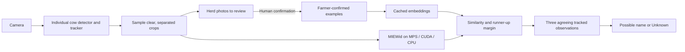

# Cow identity trial

This branch adds a local identity assistant: it collects individual cow photos, lets a farmer name them, and suggests those names on later camera observations. It is an experimental tool for building and checking a herd gallery, not a reliable unattended animal-identification system yet.

## Try it

Use the detector and web app from this branch together. Follow the normal [source setup](../../detector/README.md#run-from-source) and [web development instructions](../../web/README.md), including a fresh locked dependency sync. Existing camera settings do not need migration.

1. In **Settings**, add or select a camera that shows clear, separated individual cows, such as a passageway. Start with one camera; crowded overhead views are a difficult case in the measured video trial.
2. Add a detector using **Cow Identity**, select its cameras, save, and start monitoring. The first start downloads the animal embedding model and the normal YOLO detector. Keep the existing behaviour detectors if you also want mounting/calving alerts.
3. Open **Herd** and refresh the photos. Choose **Identify cow**, then enter the cow's familiar name or ear-tag number. Confirm only pictures you can identify yourself.
4. Add examples for at least two different cows. Add varied, clear views of each cow, especially from each camera that will be used. One animal in the gallery cannot establish a meaningful runner-up comparison.
5. The camera overlay can now show **Possible 274**, for example. Ambiguous or unsuitable observations remain **Unknown**. Review suggestions before adding them to the gallery.
6. Use **Edit examples** to remove a mistaken example; it returns to review. A cow can be renamed or removed. Corrections affect subsequent matching, not archived results. Pending photos keep their images but lose suggestions made using an older gallery revision.

The application never teaches itself from an unconfirmed prediction. The gallery belongs to this installation and is shared by its configured identity detectors. A second farm should use a separate data directory. Familiar names are labels you supply; the model does not read ear tags.

## What runs

MIEWid msv3 is the default because it performed best in the measured comparison. The reviewed local architecture loads a pinned safetensors checkpoint; it executes no downloaded Python. DINOv2 at 224 or 336 pixels remains an advanced baseline. The revised trial preset uses YOLO26m-seg at 640 pixels and 0.25 cow confidence for better crop collection; identity still uses bounding-box crops, not segmentation masks. Inference uses CUDA when available, otherwise MPS on supported Macs, otherwise CPU. Identity inference is FP32. Metal inference takes the same process-wide lock as YOLO, preventing concurrent model calls on MPS.

The initial policy requires cosine similarity of 0.65, a 0.10 margin over a different cow, and three qualifying observations from one tracked animal. These are trial settings, not probabilities or universal thresholds. Samples are taken at most once per second by default. Border-clipped, small and strongly overlapping boxes are rejected. Two simultaneous tracks cannot receive the same proposed identity in one camera observation. Gaps, rejected samples and gallery edits reset agreement. A tracker ID itself is never treated as a permanent cow identity.

The dedicated preset detects individual cows. Cow Catcher's mounting boxes may contain two cows, so the implementation deliberately does not assign one identity to an entire mounting box. Linking behaviour events to individual actors remains future work.

Only confirmed-gallery embeddings are cached by the running application. New camera pixels are sampled rather than continuously written into an embedding database. Research experiments also cache all evaluated images, allowing matching/threshold changes without rerunning the GPU. Cache fingerprints include content, weights, preprocessing, device and library versions. Gallery changes recompute cheap matching and reuse unchanged example embeddings.

## Evidence and limits

See [the actual-policy video assessment](VIDEO_ASSESSMENT.md), [cropped-image benchmark](BENCHMARK.md), [research review](RESEARCH.md), and [source revisions](sources.json).

On the fixed 1,251-image MultiCamCows development panel, MIEWid achieved 88 correct identities among 89 accepted multiview queries, with 69.84% known-cow coverage. When examples came from only one camera and queries from other cameras, that fell to 37 correct among 44 accepted queries. This difference matters more than the attractive multiview result. DINOv2 was faster but performed substantially worse.

The comparison pools three selected photographs per query and calibrates thresholds separately. It is **not the live track policy**. The stricter initial application thresholds and temporal agreement accept considerably fewer animals. Full count tables, unknown-cow errors, calibration separation and exploratory gallery adaptation are recorded in the benchmark. Gallery adaptation is research-only until it improves held-out video with the actual runtime policy.

The actual live policy also underwent a harder public 8-Calves video evaluation, with six enrolled animals, two withheld unknowns, and several minutes between enrollment and queries. The initial detector localized only 4.04% of visible annotated animals. The stronger detector improved this to 27.08%, then 23.78% in a second, previously unused five-minute segment. **Neither segment produced any accepted identity names.** Even annotated boxes with perfect tracking produced only 21 correct named observations (one calf), or 1.17% known-cow coverage. This is an important negative result: the current trial does not solve identification in crowded pens with a small early gallery. The stronger preset improves photo collection, not proven naming accuracy. Richer enrollment and better separation of overlapping animals are the next research priorities; zero accepted names does not demonstrate reliability.

A separate 30-second public 8-Calves video smoke exercises actual YOLO tracking, the production MIEWid encoder on MPS, crop collection, publisher-annotated enrollment, cached gallery loading and live JSON publication. That checks integration; near-time enrollment does not establish recognition accuracy. Its reproducible runner is `smoke_runtime.py` and the retained report is under `results/2026-10-03/`.

Known limitations:

- Cross-camera, opposite-side, night/IR, solid-coated breeds, heavy occlusion and new farms need separate evaluation. Unknown is an expected and useful outcome.
- Identity shares the detector process and GPU. Initial downloads delay startup; model/file failures remain visible and use the existing process recovery policy. Failure isolation from behaviour monitoring is not implemented.
- The preset samples at one-second intervals. Tracker continuity and the rate of useful crops need tuning on real camera footage, without weakening identity rejection to manufacture coverage.
- No training, automatic enrollment, farm-management import, historical identity search, behaviour-to-cow association or Telegram identity confirmation is included.
- The source application and a frozen macOS encoder executable have been verified on MPS. The complete installer and Windows CUDA execution have not been validated for this feature.

## Files and maintenance

All identity data lives below the existing application data directory:

| Path | Owner and purpose |
| --- | --- |
| `identities/catalog.json` | Web app; versioned, human-confirmed cow names and example references |
| `identities/images/` | Detector; JPEG crops referenced by sightings and confirmed examples |
| `identities/sightings/` | Detector; immutable observation records with hashed camera sources |
| `identities/embeddings.sqlite` | Detector; disposable, versioned embedding cache |
| `models/identity/` | Pinned downloaded model weights |

New photo collection stops at 200 pending photos; recognition continues. Confirm or discard photos to make room. Removing confirmed examples can return additional existing photos to review. A cow has up to 32 confirmed examples; the gallery allows up to 500 cows. Those are storage bounds, not verified accuracy or performance at that herd size. Small inference batches limit image memory during gallery loading. The embedding cache currently keeps prior model/example entries; it can be removed while monitoring is stopped. Back up the entire `identities/` directory to preserve the herd: the existing settings-only backup does not include it.

## Reading and changing the code

- `detector/src/aidetector/domain/identity.py`: pure acceptance, ambiguity and temporal agreement.
- `detector/src/aidetector/adapters/inference/identity_observations.py`: geometry checks, sampling, gallery matching and review collection.
- `detector/src/aidetector/adapters/inference/miewid.py`: measured default encoder; `identity.py`: baseline encoder and cache.
- `detector/src/aidetector/adapters/identity_catalog.py`: read confirmed data and publish sightings.
- `detector/src/aidetector/application/pipeline.py`: optional enrichment of the newly inferred observation only.
- `web/src/lib/server/identity-catalog.ts` and `web/src/routes/(admin)/herd/`: atomic, revision-checked human review.

The identity configuration is optional and generic; cow labels and detector choices live in the preset. Existing detectors import no identity models unless the feature is configured. The JSON schema requires tracking when identity is present. Existing event files remain readable; new event metadata may contain an additive list of identity suggestions.

Run the normal detector and web quality commands. Focused contracts are in `tests/domain/test_identity.py`, `tests/adapters/test_identity_catalog.py`, `tests/adapters/inference/test_identity_observations.py`, and `web/tests/identity-catalog.test.ts`. The [benchmark guide](BENCHMARK.md#reproduce) explains the pinned research environment and inference-free replay.

## Next iterations, in priority order

1. Collect a small, independently labelled farm trial over several days with varied views. Freeze enrollment and thresholds before scoring a held-out day. Report false names per cow-hour, unknown rate, coverage and identity switches.
2. Test actual tracker continuity and crop selection on that footage. Measure the whole camera pipeline alongside mounting/calving detection, not just embedding throughput.
3. Add a clear herd backup/restore flow and identity-specific failure isolation before wider deployment.
4. Compare gallery-only feature adaptation and mask-assisted cropping on the same frozen video protocol. Keep only improvements that survive the real policy and latency budget.
5. Associate individually identified animals with behaviour boxes using spatial/temporal evidence and explicit ambiguity, then add optional per-cow history.
6. Explore cattle-specific training or a small projection head only after the error analysis shows why the frozen model fails. Keep useful hard examples and corrections; never call guessed names ground truth.

## Verification on 3 October 2026

The final detector suite passed 670 tests with four skips. Web checks passed 359 tests with one platform skip, 15 desktop tests and 12 production HTTP tests; the production web build, lint, types, schema generation and dependency checks passed. Eight research tests validate scoring and evaluator bookkeeping. Browser checks covered enrollment, correction and responsive layouts using real public cow photos. Source and frozen encoder inference ran on MPS; Windows/Jetson execution and the complete installer remain untested for this feature.

An earlier concurrent build/test run had one existing CLI signal-shutdown timeout. All six shutdown variants, 20 focused pytest repeats, 100 diagnostic subprocess repeats and the final full suite subsequently passed. No timeout was increased and no speculative shutdown fix was made; the isolated failure remains unexplained.
