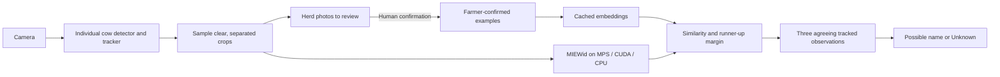

# Cow identity trial

This branch adds a local identity assistant: it collects individual cow photos, lets a farmer name them, and suggests those names on later camera observations. It is an experimental tool for building and checking a herd gallery, not a reliable unattended animal-identification system yet.

## Try it

Use the detector and web app from this branch together. Follow the normal [source setup](../../detector/README.md#run-from-source) and [web development instructions](../../web/README.md), including a fresh locked dependency sync. Existing camera settings do not need migration.

1. In **Settings**, add or select a camera that shows clear, separated individual cows, such as a passageway. Start with one camera; crowded overhead views are a difficult case in the measured video trial.
2. Add a detector using **Cow Identity**, select its cameras, save, and start monitoring. The first start downloads the normal YOLO detector. The identity model prepares in the background once at least two animals have confirmed photos. Keep the existing behaviour detectors if you also want mounting/calving alerts.
3. Open **Herd** and refresh the photos. Choose **Identify cow**, then enter the cow's familiar name or ear-tag number. Confirm only pictures you can identify yourself.
4. Add examples for at least two different cows. Add varied, clear views of each cow, especially from each camera that will be used. One animal in the gallery cannot establish a meaningful runner-up comparison.
5. The camera overlay can now show **Possible 274**, for example. Ambiguous or unsuitable observations remain **Unknown**. Review suggestions before adding them to the gallery.
6. Use **Edit examples → Change cow** to move a mistaken example directly to the correct cow. A confirmed reference appears beside the photo so you can compare them. Remove unclear examples to return them to review. A cow can also be renamed or removed. Corrections affect subsequent matching, not archived results. Pending photos keep their images but lose suggestions made using an older gallery revision.

The application never teaches itself from an unconfirmed prediction. The gallery belongs to this installation and is shared by its configured identity detectors. A second farm should use a separate data directory. Familiar names are labels you supply; the model does not read ear tags.

## What runs

MIEWid msv3 is the default because it performed best in the measured comparison. The reviewed local architecture loads a pinned safetensors checkpoint; it executes no downloaded Python. DINOv2 at 224 or 336 pixels remains an advanced baseline. The revised trial preset uses YOLO26m-seg at 640 pixels and 0.25 cow confidence for better crop collection; identity still uses bounding-box crops, not segmentation masks. Inference uses CUDA when available, otherwise MPS on supported Macs, otherwise CPU. Identity inference is FP32. Metal inference takes the same process-wide lock as YOLO, preventing concurrent model calls on MPS.

The initial policy requires cosine similarity of 0.65, a 0.10 margin over a different cow, and three qualifying observations from one tracked animal. These are trial settings, not probabilities or universal thresholds. Samples are taken at most once per second by default. Border-clipped, small and strongly overlapping boxes are rejected. Two simultaneous tracks cannot receive the same proposed identity in one camera observation. Gaps, rejected samples and gallery edits reset agreement. A tracker ID itself is never treated as a permanent cow identity.

The dedicated preset detects individual cows. Cow Catcher's mounting boxes may contain two cows, so the implementation deliberately does not assign one identity to an entire mounting box. Linking behaviour events to individual actors remains future work.

Only confirmed-gallery embeddings are cached by the running application. New camera pixels are sampled rather than continuously written into an embedding database. Research experiments also cache all evaluated images, allowing matching/threshold changes without rerunning the GPU. Cache fingerprints include content, weights, preprocessing, device and library versions. Gallery changes recompute cheap matching and reuse unchanged example embeddings.

## Evidence and limits

See [the actual-policy video assessment](VIDEO_ASSESSMENT.md), [cropped-image benchmark](BENCHMARK.md), [detection training](DETECTION_STUDY.md), [foreground/local-pattern controls](SEGMENTATION_STUDY.md), [research review](RESEARCH.md), and [source revisions](sources.json).

One continuous-tracking candidate now meets the numerical targets on exposed
development footage. Complete app-runtime verification, reserved evaluation and
application integration remain outstanding. These controls measure different
things and are not interchangeable accuracy estimates:

| Control | Measured outcome | Decision |
| --- | --- | --- |
| Original application on crowded calf footage | No accepted names in either initial five-minute window | Keep experimental; software integration alone is insufficient. |
| Mixed public/adapted animal detector | Much better localization, but fragmented tracks and inadequate naming coverage | Research checkpoint only. |
| Cutie with eight manually supplied first-frame masks | Strong continuous tracking; later masks can merge two cows while staying confident | Test conflict handling before considering integration. |
| Cutie with collision quarantine | 71.04% correct naming coverage and 99.38% precision in calibration; both earlier development windows remain below 99% precision | Promising, but not a passed system. |
| Same Cutie policy with five input frames per second | 79.89–86.71% coverage across the three exposed panels; precision remains 98.55–98.67% | Faster sampling improves coverage but does not meet the accuracy target. |
| Cutie plus a separate detector's geometry confirmation | A predefined IoU 0.5 condition reaches 63.34–68.65% coverage and 99.13–99.36% precision across the exposed panels | Promising development choice. The earlier calibration-only selector chose the failing baseline; actual initialization and continuous execution still require verification. |
| Same policy with reviewed detector proposals as initial masks and stateless detector confirmation | 54.71–70.28% coverage and 98.91–99.52% precision across the exposed panels | Fails: the initial-mask change alters later conflicts, and one segment loses too much coverage. The earlier favorable result is insufficient for integration. |
| Reciprocal geometry confirmation on that actual-seed run | 53.54–68.89% coverage and 99.20–99.51% precision | Preventing one proposal from confirming two identities improves precision; the middle segment still fails coverage. Averaging box coordinates adds no useful improvement. |
| Reciprocal confirmation plus current-evidence recovery after a conflict | 68.15–72.03% coverage and 99.20–99.51% precision; no withheld cow named | First actual-initialization candidate to meet all three development targets. It still needs combined execution, reserved evaluation and integration. |
| Additional MIEW appearance on those masks | Its selected combination with quarantine adds no benefit over quarantine alone | Do not add an extra live encoder for this purpose without new evidence. |
| Temporal pooling of MIEW mask features | The calibration selector prefers the unsmoothed baseline; it still misses the coverage target | No improvement demonstrated; pooling combined with quarantine has not been tested. |
| [Next-day passage test](CONTROLLED_PASSAGE.md) using the application | Two correct names among 46 visible known-cow observations; most visible animals are clipped at the frame boundary | Test separate whole-animal tracking and visible-torso crops. |
| [Adapted passage detector](PASSAGE_ADAPTATION.md) with separate torso crops | All 49 definite visible boxes localized, but only three correct names among 46 known observations | Localization improves; torso availability, boundary rejection and temporal agreement still prevent useful coverage. |
| Same passage model allowing border-contact torso crops | Five correct names among 46 known observations; a one-second hold during absent torso evidence adds none | More diverse enrollment views and continuity need evaluation; matching thresholds remain unchanged. |
| Chronologically varied, independently reviewed first-day references plus a five-second confirmed-track hold | Fourteen correct names among 46 known observations; no named errors | Improves cross-day coverage to 30.43%, still below the target. Two cows never obtain a confirmed name. |

Reserved video windows remain closed while these controls are developed. The
earlier Cutie results use precise initial masks and names supplied by an idealized
farmer. Later controls use reviewed detector proposals; their successful
development candidate still assumes correct initial names. None establishes
automatic enrollment, new arrivals, recovery after
restart, or recognition on another day. Every experiment retains its failed
conditions and source hashes under `results/2026-10-03/`.

On the fixed 1,251-image MultiCamCows development panel, MIEWid achieved 88 correct identities among 89 accepted multiview queries, with 69.84% known-cow coverage. When examples came from only one camera and queries from other cameras, that fell to 37 correct among 44 accepted queries. This difference matters more than the attractive multiview result. DINOv2 was faster but performed substantially worse.

The comparison pools three selected photographs per query and calibrates thresholds separately. It is **not the live track policy**. The stricter initial application thresholds and temporal agreement accept considerably fewer animals. Full count tables, unknown-cow errors, calibration separation and exploratory gallery adaptation are recorded in the benchmark. Gallery adaptation is research-only until it improves held-out video with the actual runtime policy.

The actual live policy also underwent a harder public 8-Calves video evaluation, with six enrolled animals, two withheld unknowns, and several minutes between enrollment and queries. The initial detector localized only 4.04% of visible annotated animals. The stronger detector improved this to 27.08%, then 23.78% in a second, previously unused five-minute segment. **Neither segment produced any accepted identity names.** Even annotated boxes with perfect tracking produced only 21 correct named observations (one calf), or 1.17% known-cow coverage. This is an important negative result: the current trial does not solve identification in crowded pens with a small early gallery. The stronger preset improves photo collection, not proven naming accuracy. Richer enrollment and better separation of overlapping animals are the next research priorities; zero accepted names does not demonstrate reliability.

A separate 30-second public 8-Calves video smoke exercises actual YOLO tracking, the production MIEWid encoder on MPS, crop collection, publisher-annotated enrollment, cached gallery loading and live JSON publication. That checks integration; near-time enrollment does not establish recognition accuracy. Its reproducible runner is `smoke_runtime.py`; the latest [background-preparation report](results/2026-10-03/runtime-background-smoke.json) processed 153 tracked boxes in 4.61 seconds while exercising asynchronous gallery preparation.

Known limitations:

- Cross-camera, opposite-side, night/IR, solid-coated breeds, heavy occlusion and new farms need separate evaluation. Unknown is an expected and useful outcome.
- Identity shares the detector process and GPU. Background preparation and expected file/download failures allow detection to continue; unexpected runtime/accelerator faults use the existing process recovery policy. Shutdown cancels queued preparation and checks between batches, but an already-running native inference/download call cannot be interrupted by the Python worker.
- The preset samples at one-second intervals. Tracker continuity and the rate of useful crops need tuning on real camera footage, without weakening identity rejection to manufacture coverage.
- No training, automatic enrollment, farm-management import, historical identity search, behaviour-to-cow association or Telegram identity confirmation is included.
- The source application and a frozen macOS encoder executable have been verified on MPS. The complete installer and Windows CUDA execution have not been validated for this feature.

## Files and maintenance

All identity data lives below the existing application data directory:

| Path | Owner and purpose |
| --- | --- |
| `identities/catalog.json` | Web app; versioned, human-confirmed cow names and example references |
| `identities/images/` | Detector; JPEG crops referenced by sightings and confirmed examples |
| `identities/sightings/` | Detector; immutable observation records with hashed camera sources |
| `identities/embeddings.sqlite` | Detector; disposable, versioned embedding cache |
| `models/identity/` | Pinned downloaded model weights |

New photo collection stops at 200 pending photos; recognition continues. Confirm or discard photos to make room. Removing confirmed examples can return additional existing photos to review. A cow has up to 32 confirmed examples; the gallery allows up to 500 cows. Those are storage bounds, not verified accuracy or performance at that herd size. Small inference batches limit image memory during gallery loading. The embedding cache currently keeps prior model/example entries; it can be removed while monitoring is stopped. Settings backup includes confirmed names, reference photos and their evidence metadata. Fresh-setup import restores them without replacing an existing herd; unconfirmed photos and disposable caches are excluded.

Photo collection starts without downloading the identity model. Matching prepares it and the reference gallery in the background after at least two animals have photos. Herd changes immediately clear old names; obsolete preparation cannot restore them. Expected file, gallery, cache and download errors suspend identity enrichment with a diagnostic and rule-scoped status, then retry after 60 seconds of monotonic wall time. Other detection continues. Runtime/accelerator errors remain process-supervised; this is not separate process isolation.

## Reading and changing the code

- `detector/src/aidetector/domain/identity.py`: pure acceptance, ambiguity and temporal agreement.
- `detector/src/aidetector/adapters/inference/identity_observations.py`: geometry checks, sampling, gallery matching and review collection.
- `detector/src/aidetector/adapters/inference/miewid.py`: measured default encoder; `identity.py`: baseline encoder and cache.
- `detector/src/aidetector/adapters/identity_catalog.py`: read confirmed data and publish sightings.
- `detector/src/aidetector/application/pipeline.py`: optional enrichment of the newly inferred observation only.
- `web/src/lib/server/identity-catalog.ts` and `web/src/routes/(admin)/herd/`: atomic, revision-checked human review.

The identity configuration is optional and generic; cow labels and detector choices live in the preset. Existing detectors import no identity models unless the feature is configured. The JSON schema requires tracking when identity is present. Existing event files remain readable; new event metadata may contain an additive list of identity suggestions.

Run the normal detector and web quality commands. Focused contracts are in `tests/domain/test_identity.py`, `tests/adapters/test_identity_catalog.py`, `tests/adapters/inference/test_identity_observations.py`, and `web/tests/identity-catalog.test.ts`. The [benchmark guide](BENCHMARK.md#reproduce) explains the pinned research environment and inference-free replay.

## Current research priorities

1. Improve actual track continuity and crop quality under the [frozen video protocol](ITERATION_PROTOCOL.md). The mixed detector substantially improves localization, but confirmed naming coverage remains too low. Foreground cleanup, local matching and external training have not solved this.
2. Measure the value and effort of additional farmer confirmations. The separate enrollment arm uses a fixed question budget and tests only later footage; repeated or unknown answers count as work too.
3. Test only materially different adaptation hypotheses. The original 60-photo partial-backbone fine-tune, public metric head and external full-backbone adaptation are documented negative controls, not production features.
4. Open the reserved windows only after a complete method has shown useful development performance and its settings are frozen. Then perform a small independently labelled multi-day farm trial, including night and camera changes.
5. Verify complete installer behaviour and camera throughput on each supported platform before wider deployment. Confirmed-herd backup/restore and background preparation already use the normal application flows.
6. Associate reliably identified individual animals with behaviour events and add per-cow history only after identity reliability is established. Never treat predicted names as confirmed training labels.

## Verification on 3 October 2026

The latest completed detector suite passed 678 tests with four skips. Web checks passed 373 tests with one platform skip, 15 desktop tests and 12 production HTTP tests; the production web build, lint, types, schema generation and dependency checks passed. The latest complete research suite passed 133 tests, with Ruff and formatting checks also passing. Later experiments have additional focused checks. Browser checks covered enrollment, correction, background preparation, recovery, confirmed-herd backup and responsive layouts using real public cow photos. Source and frozen encoder inference ran on MPS; Windows/Jetson execution and the complete installer remain untested for this feature. Research and the active acceptance goal continue; these software checks do not establish identification accuracy.

An earlier concurrent build/test run had one existing CLI signal-shutdown timeout. All six shutdown variants, 20 focused pytest repeats, 100 diagnostic subprocess repeats and the final full suite subsequently passed. No timeout was increased and no speculative shutdown fix was made; the isolated failure remains unexplained.
