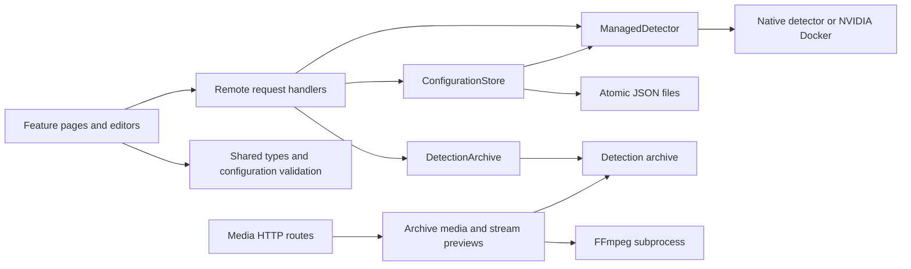

# Web application architecture

Start with one use case: `routes/(admin)/setup/+page.svelte` calls `remote/setup.remote.ts`, which delegates to `server/configuration/store.ts`. The store validates the canonical detector schema, persists settings and applies a changed configuration to the managed detector. The route does not know where files live or how a process is started.

## Where a change belongs

| Concern                                       | Read first                                                   | Regression tests                                       |
| --------------------------------------------- | ------------------------------------------------------------ | ------------------------------------------------------ |
| Setup, detector/source/notification edits     | `lib/configuration.ts`, `server/configuration/store.ts`      | `configuration.test.ts`, `detector-editor.test.ts`     |
| Starting, stopping, restarting and resuming   | `server/managed-detector.ts`, `runtime-platform.ts`          | `runtime.test.ts`                                      |
| Archived detections, pagination and playback  | `server/archive.ts`, `archive-media.ts`, `lib/detections.ts` | `archive.test.ts`                                      |
| Camera preview lifetime and FFmpeg resolution | `server/stream-preview.ts`, `ffmpeg.ts`                      | `preview.test.ts`                                      |
| Editable form state                           | The feature's `add/*-editor.svelte`                          | Draft-helper tests plus browser verification           |
| Dependency direction                          | `.dependency-cruiser.cjs`                                    | `architecture.test.ts` deliberately violates the rules |

Paths in the table are relative to `src/` (code) or `tests/` (tests). `lib/server/configuration/index.ts` is the composition point for the singleton store; `server/detector-service.ts` owns the singleton runtime. Other services accept their dependencies explicitly and can be tested with Node's test runner. There is no container or generic repository framework.

`node-server.mjs` starts the official Node adapter with the local HTTP transport configured. Use `pnpm start`; HTTPS reverse proxies supply an explicit `ORIGIN` (see the README). `tests/production/` tests the built server, separately from the fast source tests.

## Boundaries and ownership

- Shared types describe configuration, runtime status and archive records. Shared configuration validation uses Ajv with the Python-generated JSON schema. Valibot validates web-only request fields.
- Remote handlers own SvelteKit request validation, redirects and translating expected input errors. They call server services directly, not other remote handlers.
- `ConfigurationStore` serializes reads and edits in one web process. Each JSON replacement uses an atomic rename. This is not a cross-process lock or a transaction spanning two files; do not run multiple web writers against the same data folder.
- `ManagedDetector` serializes lifecycle commands. Stop cancels queued startup work, child checks finish before temporary files are deleted, and process output is bounded and redacted. Polling observes state; it does not create processes.
- Each stream preview owns its FFmpeg child until the child closes. Client disconnects, read timeouts and EOF all release it; a force-kill deadline survives closing the HTTP response.
- Archive reads validate metadata and confine decoded paths and symbolic links to the archive. Missing files are different from malformed records or I/O failures. Videos stream with byte ranges rather than loading into memory in full. The card identity includes category, stage and timestamp; overlapping offset pages are deduplicated when new events arrive.
- Editor drafts are separate from saved configuration. Incomplete advanced JSON never becomes the basic form's live object. Snapshot detectors keep their absent/null YOLO configuration.

There are no separate domain/use-case/port folders here because this application primarily coordinates files and processes. Concrete services and small shared models express the current boundaries without mirroring the detector's richer event domain.

## Quality commands

`pnpm quality` runs formatting, ESLint, strict Svelte/TypeScript checking, dependency rules and behavioral tests. Application functions have an ESLint cyclomatic complexity ceiling of 15 and nesting ceiling of 4. Those limits prompt review; they do not prove readability or justify splitting a coherent function just to lower a number. The preserved shadcn library is excluded from the complexity ceiling, not from type or formatting checks.

`pnpm test:coverage` measures executed shared/server code. It does not measure browser interactions or prove platform behavior. `pnpm build` checks the actual adapter output. `pnpm test:production` then exercises the built Node server over HTTP, including setup, origin checks and process shutdown. CI runs all three.

`pnpm architecture:graph` writes `.reports/dependencies.mmd`, a Mermaid graph of server code and its local dependencies; open it beside the source in VS Code. `pnpm architecture:metrics` prints module coupling metrics. The checked rules reject feature cycles, presentation imports from services, Node imports from browser/request code, and unresolved project imports. The negative test proves alias, dynamic import and type-only violations are detected.

Dependency-cruiser uses its own resolver: `tools/dependency-resolution.mjs` supplies SvelteKit's `$lib` alias and TypeScript `.js` imports. Its pinned patch enables the same Svelte async compiler flag used by the app. Remove that patch when the analyzer supports this option directly. SvelteKit virtual imports and third-party package resolution are checked by Svelte/Vite; project import resolution is checked by the dependency graph too.
