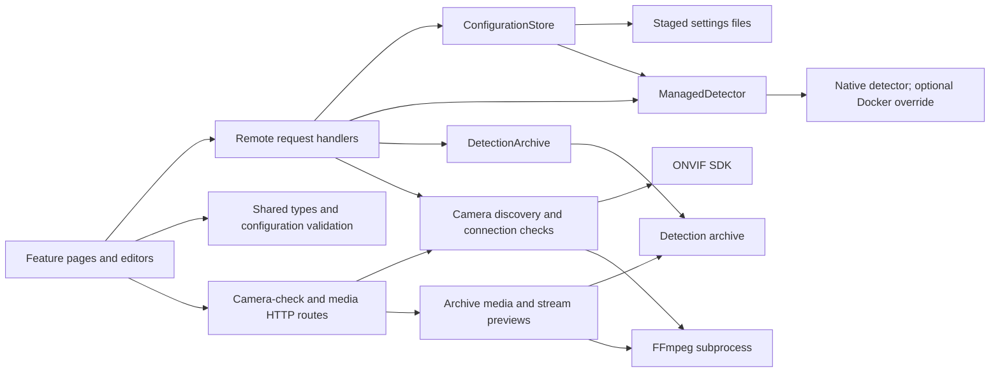

# Web application architecture

Start with the three-step setup page: add cameras, choose detectors, then finish checks. `lib/components/camera-editor.svelte` calls `lib/remote/camera.remote.ts` to find a device and resolve its stream profile. `lib/camera-check.ts` checks a short recording through the `/camera-checks` HTTP route; leaving the editor cancels the fetch and its FFmpeg work. The preview appears alongside the connection fields; saving confirms the camera without a separate test screen, playback requirement or checkbox. The editor calls `lib/remote/stream.remote.ts` to save the named camera. The detector editor separately selects presets and camera assignments through `lib/remote/detector.remote.ts`. Both use `lib/server/configuration/store.ts`, which validates the canonical detector schema, persists settings and applies changed monitoring settings to the managed detector. The same editors handle initial setup and later changes; they do not know where files live or how a process is started.

## Where a change belongs

| Concern                                       | Read first                                                                                    | Regression tests                                                                     |
| --------------------------------------------- | --------------------------------------------------------------------------------------------- | ------------------------------------------------------------------------------------ |
| Setup and request validation                  | `lib/configuration.ts`, `lib/server/configuration/store.ts`                                   | `configuration.test.ts`, `detector-editor.test.ts`                                   |
| Detector, source and notification edit rules  | `lib/server/configuration/detectors.ts`, `streams.ts`, `telegrams.ts`                         | `configuration.test.ts`                                                              |
| Settings persistence and failure recovery     | `lib/server/configuration/files.ts`, `lib/server/json-file.ts`                                | `configuration.test.ts`                                                              |
| Starting, stopping, restarting and resuming   | `lib/server/managed-detector.ts`, `lib/server/runtime-platform.ts`                            | `runtime.test.ts`                                                                    |
| Archived detections, pagination and playback  | `lib/server/archive.ts`, `lib/server/archive-media.ts`, `lib/detections.ts`                   | `archive.test.ts`                                                                    |
| Camera discovery, connection, test recording  | `lib/server/cameras/`, `lib/cameras.ts`, `lib/camera-check.ts`                                | `cameras.test.ts`, `camera-check.test.ts`, `production/camera-cancellation.test.mjs` |
| Camera and alert assignment                   | `lib/server/configuration/cameras.ts`                                                         | `camera-configuration.test.ts`, `telegram.test.ts`                                   |
| Operational readiness                         | `lib/server/runtime-status.ts`, `lib/runtime.ts`                                              | `runtime-status.test.ts`, `runtime.test.ts`                                          |
| Camera preview lifetime and FFmpeg resolution | `lib/server/stream-preview.ts`, `lib/server/ffmpeg.ts`                                        | `preview.test.ts`                                                                    |
| Analysed frames and viewer lifetime           | `lib/server/live-preview.ts`, `lib/components/live-detections.svelte`, `lib/preview-slots.ts` | `live-preview.test.ts`, `preview-slots.test.ts`                                      |
| Batch camera connection queue                 | `lib/camera-batch.ts`, `lib/components/camera-batch.svelte`                                   | `camera-batch.test.ts`                                                               |
| Editable form state                           | `lib/components/camera-editor.svelte` and the feature's `add/*-editor.svelte`                 | Draft-helper tests plus browser verification                                         |
| Dependency direction                          | `.dependency-cruiser.cjs`                                                                     | `architecture.test.ts` deliberately violates the rules                               |

Paths in the table are relative to `src/` (code) or `tests/` (tests); `.dependency-cruiser.cjs` is at the web project root. `lib/server/configuration/index.ts` is the composition point for the singleton store; `lib/server/detector-service.ts` owns the singleton runtime. Other services accept their dependencies explicitly and can be tested with Node's test runner. There is no container or generic repository framework.

`node-server.mjs` starts the official Node adapter with the local HTTP transport configured. Use `pnpm start`; HTTPS reverse proxies supply an explicit `ORIGIN` (see the README). `tests/production/` tests the built server, separately from the fast source tests.

The executable adapter delegates lifecycle to `desktop/runtime.ts`. That runtime binds the port before initializing SvelteKit, owns the parent pipe and shutdown, and delegates optional LAN discovery to `bonjour-service`. `desktop/paths.ts` supplies the same data-directory rules to the bootstrap and server stores. The adapter patch contains integration hooks rather than application behaviour. Desktop code has its own strict TypeScript configuration and participates in `pnpm quality`.

Detector process completion retains its exit status. A failed or forced drain rejects shutdown through the service hook to the desktop runtime; it cannot become a successful native update restart. The native shell owns error dialogs and receives a bounded `AI_DETECTOR_ERROR ` summary through stderr. Compiled-executable tests cover successful, failed and timed-out draining with a local detector fixture.

## Boundaries and ownership

- Shared types describe configuration, runtime status and archive records. `lib/generated/` contains TypeScript declarations generated from the Python-owned JSON schemas by `json-schema-to-typescript`, a development dependency. `lib/schema.ts` derives the web's normalized lists and empty-setup types from those declarations, and infers web-only metadata types from Valibot schemas. `lib/configuration.ts` composes request schemas and uses Ajv with the Python-generated detector schema; it does not maintain a second detector schema. Archive category and stage belong to the web's `Detection` type, not to the detector's metadata file.
- Remote handlers own SvelteKit request validation, redirects and translating expected input errors. They call server services directly, not other remote handlers.
- `ConfigurationStore` serializes reads, edits, persistence and runtime application in one web process. Changed detector settings are staged together with their metadata; ordinary replacement failures restore the previous metadata before rejecting the save. This is not a cross-process lock or a power-loss-safe transaction; do not run multiple web writers against the same data folder.
- Configuration edit modules operate on the in-memory document: `detectors.ts` preserves preset identity, `streams.ts` maintains source references, and `telegrams.ts` propagates recipient changes. They do not load files, start processes or save settings. Callers use the store's public operations so every edit stays inside its serialized read/save/apply boundary.
- `ManagedDetector` serializes lifecycle commands. Stop cancels queued startup work, child checks finish before temporary files are deleted, and process output is bounded and redacted. Polling observes state; it does not create processes.
- `hooks.server.ts` initializes monitoring during server startup, independently of browser requests. Automatic mode selects the bundled native runtime. Packaged relaunch/quit belongs in `desktop/`; native menus and installers belong in `distribution/`. Request handlers do not own desktop lifecycle.
- `RuntimeProgress` consumes the detector’s versioned status records. A spawned process is not a ready camera: every configured rule must report completed processing, frames must remain fresh, and recording failures remain attributed to their own destinations. Human logs are diagnostic text, never the readiness protocol.
- The admin layout provides one runtime monitor through Svelte context. `lib/hooks/runtime-status.svelte.ts` uses SvelteKit's query for data, loading and errors; Svelte's `createSubscriber` starts a single polling loop while any view reads its status and stops it after the last view leaves. The camera page and monitoring card share the last successful check time and ten-second stale threshold. Start/stop commands refresh that same query. Failed refreshes retain the last good status while showing that it is unavailable.
- Camera discovery uses the ONVIF SDK; FFmpeg checks actual recording and playback. Temporary checks expire after 15 minutes, are bounded, and use opaque URLs. Saved camera previews use stable IDs; credentials never belong in navigation URLs.
- Camera edits preserve IDs, existing rules and alert relationships unless the user changes them. Alert assignment can split a shared rule so a recipient only receives selected cameras.
- Each stream preview owns its FFmpeg child until the child closes. The Remix multipart parser separates complete JPEGs while stdout is continuously drained. A slow browser receives the latest picture, replacing superseded pictures instead of backpressuring camera capture; per-picture memory stays bounded. Multipart upload count/total limits are disabled for these ongoing streams. Client disconnects, frame timeouts and EOF all release the child; a force-kill deadline survives closing the HTTP response.
- Analysed previews use the detector's [latest-frame transport](../detector/LIVE_PREVIEW.md), without opening another camera connection. `lib/live-preview.ts` owns the Valibot frame schema and infers its shared type; the web adds the configured rule label. The server validates records once and owns viewer leases/SSE cleanup. The UI shows matching image/boxes, tracks connection freshness, and releases invisible previews. `PreviewSlots` caps active feeds at four per browser tab. Live views never establish recording or alert success.
- Batch setup coordinates bounded ONVIF connection attempts and keeps successful results in memory. Each selected camera still passes the automatic recording check, inline preview, configuration save and completion checks. It adds no second persistence path or batch bypass around verification.
- Archive reads validate metadata and confine decoded paths and symbolic links to the archive. Missing files are different from malformed records or I/O failures. Videos stream with byte ranges rather than loading into memory in full. The small range parser preserves oversized suffix ranges and serves unsupported multipart ranges in full; `archive.test.ts` covers these protocol cases. The card identity includes category, stage and timestamp; overlapping offset pages are deduplicated when new events arrive.
- Remote command failures are SvelteKit `HttpError` objects. `lib/remote-errors.ts` reads their public message for actionable feedback instead of replacing expected errors with a generic message.
- Editor drafts are separate from saved configuration. Incomplete advanced JSON never becomes the basic form's live object. Snapshot detectors keep their absent/null YOLO configuration.

There are no separate domain/use-case/port folders here because this application primarily coordinates files and processes. Concrete services and small shared models express the current boundaries without mirroring the detector's richer event domain.

## Settings save boundary

Preset definitions are the JSON files in `config/detector/`, embedded automatically by Vite. `configuration/preset-files.ts` enumerates files, derives names from filenames and validates detector options against the canonical schema. `configuration/presets.ts` selects a local `presets/` folder in the data directory, an explicit `AIDETECTOR_PRESETS` directory, or the bundled files. Choices are sorted by filename; users select a preset explicitly. There is no separate catalogue, description or default-preset metadata. `editor-schema.ts` independently handles advanced editor schema lookup.

`ConfigurationStore` receives the preset loader explicitly. Only choosing a new preset loads its definition during a camera save. Camera actions use a separate `mode` (`preset`, `keep`, `copy`, `view-only`); preset IDs are filename stems, including names that happen to match an action. A saved detector owns its copied configuration, not a live reference to a preset file. Existing IDs and actual rule settings survive preset edits, renames or removal; missing names fall back to the saved detector label. There are no use-case-specific branches in the application.

Camera setup proof lives with camera metadata: picture confirmation, recording-location check, alert choice and completion. `lib/components/setup-review.svelte` checks recording locations sequentially, summarizes successful checks and offers retry actions after failures. `lib/remote/camera-setup.remote.ts` exposes the combined review and finish commands. Finishing checks every camera in one serialized save operation; if any camera is unready, none is marked complete. Connection metadata contains only a safe ONVIF endpoint/profile, never another copy of login credentials. Archive checks copy and decode a temporary setup clip at the configured location, remove it afterward and publish no detection event. Completion is tied to current detector settings and checked against current runtime state; persisted completion is not a live health claim.

Telegram pairing is a bounded local interaction in `lib/server/telegram-pairing.ts`; its separate session identifier and one-use link code expire after five minutes. The grammY `Api` client handles Telegram transport, serialization and request deadlines in `lib/server/telegram.ts`; this adapter validates the reply fields used by setup and translates failures into actionable messages. It uses the Fetch-compatible `grammy/web` entrypoint in both Node and Bun. Pairing owns cancellation, update offsets and the bot reservation; it does not start a separate SDK polling loop. Polling and QR generation do not hold the configuration write queue. The browser lifetime helper retires late responses and cancels abandoned sessions. Existing recipients reuse the camera/alert save boundary; unchanged credentials do not require a repeated receipt confirmation. Dedicated-bot automatic pairing owns its update filter, while manually entered destinations remain available for bots managed elsewhere. No manager token or hosted delivery service is included.

Validation precedes any replacement: the shared schema checks every save, and a managed detector validates changed, nonempty detector settings. When detector settings change, `configuration/files.ts` stages both new JSON files and the exact previous `app.json` bytes beside their destinations. It replaces `app.json` first, then `config.json`, using a rename for each file. If the second replacement fails, it restores the staged metadata or removes the new `app.json` when none existed before. A failed restore reports both failures and retains the available metadata backup for manual recovery. Temporary-file cleanup failures are logged without changing the outcome of an already committed save.

The pair is **not atomically visible to other processes**, and a crash or power failure between replacements can leave mismatched files. There is no filesystem journal or automatic crash recovery. This deliberately small boundary handles normal I/O rejection without changing the existing file formats; it is not a backup/restore feature.

After both replacements succeed, the saved configuration remains authoritative. A failure applying it or stopping the managed runtime updates runtime failure status and does not reject the successful save, so a client does not retry an already created camera. A save result does not mean monitoring is ready; readiness comes from the runtime's status records. Metadata-only edits use `json-file.ts`, leave `config.json` untouched and skip the detector executable's validation and restart. The single-file writer delegates replacement, file synchronization and temporary-file cleanup to `write-file-atomic`, with private settings permissions. Preview leases use the same library without synchronization because they expire; their viewer lifetime remains owned by `live-preview.ts`. This library does not replace the two-file save/rollback boundary.

`configuration.test.ts` covers validation and staging failures, replacement rollback with existing or missing metadata, rollback and cleanup failures, queue recovery, concurrent camera additions, metadata-only edits, and an actual managed-runtime settings-write failure after a completed save.

## Quality commands

`pnpm quality` checks generated schema declarations, formatting, ESLint, strict Svelte/TypeScript checking, dependency rules and behavioral tests. Run `pnpm schema:generate` after regenerating the Python JSON schemas; `pnpm schema:check` reports drift without rewriting files. Application functions have an ESLint cyclomatic complexity ceiling of 15 and nesting ceiling of 4. Those limits prompt review; they do not prove readability or justify splitting a coherent function just to lower a number. The preserved shadcn library is excluded from the complexity ceiling, not from type or formatting checks.

`pnpm test:coverage` measures executed shared/server code. It does not measure browser interactions or prove platform behavior. `pnpm build` checks the actual adapter output. `pnpm test:production` then exercises the built Node server over HTTP, including setup, origin checks and process shutdown. CI runs all three.

`pnpm architecture:graph` writes `.reports/dependencies.mmd`, a Mermaid graph of server code and its local dependencies; open it beside the source in VS Code. `pnpm architecture:metrics` prints module coupling metrics. The checked rules reject feature cycles, presentation imports from services, Node imports from browser/request code, and unresolved project imports. The negative test proves alias, dynamic import and type-only violations are detected.

Dependency-cruiser uses its own resolver: `tools/dependency-resolution.mjs` supplies SvelteKit's `$lib` alias and TypeScript `.js` imports. Its pinned patch enables the same Svelte async compiler flag used by the app. Remove that patch when the analyzer supports this option directly. SvelteKit virtual imports and third-party package resolution are checked by Svelte/Vite; project import resolution is checked by the dependency graph too.
