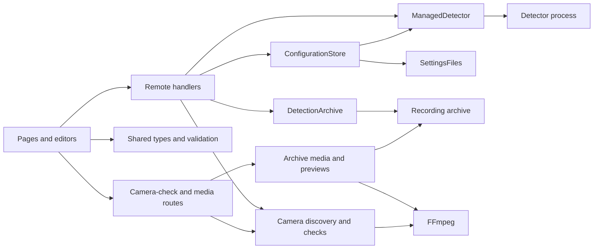

# Web application architecture

A page calls a remote handler; the handler validates the request and calls a concrete server service; the service owns files or a process. Components do not know where files live or how a process is started.

The three pages people use every day are `routes/(admin)/detections` (Recordings), `streams` (Cameras) and `detectors`. `/setup` is first-run guidance only: it renders the same `camera-add.svelte` and `detector-editor.svelte` components in three steps and ends by starting monitoring.

```mermaid
flowchart LR
    UI["Pages and editors"] --> Remote["Remote handlers"]
    UI --> Models["Shared types and validation"]
    Remote --> Config["ConfigurationStore"]
    Remote --> Runtime["ManagedDetector"]
    Remote --> Archive["DetectionArchive"]
    Remote --> Cameras["Camera discovery and checks"]
    UI --> Routes["Camera-check and media routes"]
    Routes --> Cameras
    Routes --> Media["Archive media and previews"]
    Config --> Files["SettingsFiles"]
    Config --> Runtime
    Archive --> Disk["Recording archive"]
    Media --> Disk
    Media --> FFmpeg
    Cameras --> FFmpeg
    Runtime --> Process["Detector process"]
```

There are no domain, use-case or port folders here, because this application mostly coordinates files and processes. Concrete services and small shared models express its boundaries; the event rules live in the detector.

## Where a change belongs

Paths are relative to `src/` for code and `tests/` for tests.

| Concern                                           | Read first                                                                                              | Tests                                                                   |
| ------------------------------------------------- | ------------------------------------------------------------------------------------------------------- | ----------------------------------------------------------------------- |
| Request and settings validation                   | `lib/configuration.ts`, `lib/schema.ts`                                                                 | `configuration.test.ts`                                                 |
| Settings use cases and their order                | `lib/server/configuration/store.ts`                                                                     | `configuration.test.ts`                                                 |
| Camera, detector, alert and connection edit rules | `lib/server/configuration/cameras.ts`, `detectors.ts`, `telegrams.ts`, `llms.ts`                        | `configuration.test.ts`, `camera-configuration.test.ts`, `llm.test.ts`  |
| Settings files, recovery snapshot, paired devices | `lib/server/configuration/settings-files.ts`, `files.ts`                                                | `configuration.test.ts`, `device-access.test.ts`                        |
| Starting, stopping and restarting the detector    | `lib/server/managed-detector.ts`, `detector-preparation.ts`, `runtime-platform.ts`, `nvidia-runtime.ts` | `runtime.test.ts`, `runtime-recovery.test.ts`, `nvidia-runtime.test.ts` |
| What counts as monitoring                         | `lib/server/runtime-status.ts`, `lib/monitoring.ts`                                                     | `runtime-status.test.ts`, `monitoring.test.ts`                          |
| Recordings, reviews and playback                  | `lib/server/archive.ts`, `archive-media.ts`, `lib/detections.ts`                                        | `archive.test.ts`                                                       |
| Exports, backups and diagnostics                  | `lib/server/recording-export.ts`, `settings-backup.ts`, `diagnostics.ts`, `zip-download.ts`             | `exports.test.ts`, `diagnostics.test.ts`                                |
| Camera discovery, connection and test recording   | `lib/server/cameras/`, `lib/camera-check.ts`, `lib/camera-batch.ts`                                     | `cameras.test.ts`, `camera-check.test.ts`, `camera-batch.test.ts`       |
| Camera pictures                                   | `lib/server/preview-pool.ts`, `stream-preview.ts`, `ffmpeg.ts`                                          | `preview.test.ts`                                                       |
| Detection boxes over pictures                     | `lib/server/live-preview.ts`, `source-key.ts`, `lib/camera-overlays.ts`                                 | `live-preview.test.ts`, `camera-overlays.test.ts`                       |
| Detector editor and its draft                     | `lib/detector-editor.ts`, `lib/detector-draft-storage.ts`, `lib/components/detector-editor.svelte`      | `detector-editor.test.ts`, `detector-draft-storage.test.ts`             |
| Setup checks and completion                       | `lib/server/configuration/camera-setup.ts`, `lib/hooks/setup-verifier.svelte.ts`                        | `setup.test.ts`, `camera-setup.test.ts`                                 |
| Telegram pairing and reviews                      | `lib/server/telegram*.ts`                                                                               | `telegram-pairing.test.ts`, `telegram-reviews.test.ts`                  |
| Importing an earlier installation                 | `lib/server/installation-import/`                                                                       | `installation-import.test.ts`                                           |
| Access from other devices                         | `lib/server/access.ts`, `device-access.ts`, `hooks.server.ts`                                           | `device-access.test.ts`                                                 |
| Storage cleanup                                   | `lib/server/storage.ts`                                                                                 | `storage.test.ts`                                                       |
| Navigation, look and wording                      | `lib/navigation.ts`, `lib/components/app-shell.svelte`, `routes/layout.css`, `lib/format.ts`            | `format.test.ts`                                                        |
| Languages                                         | `lib/locales.ts`, `lib/server/request-language.ts`, `locales/`                                          | `language.test.ts`                                                      |
| Desktop process and network discovery             | `../desktop/`                                                                                           | `../desktop/*.test.ts`                                                  |
| Dependency direction                              | `../.dependency-cruiser.cjs`                                                                            | `architecture.test.ts`                                                  |

Services take their dependencies as constructor arguments and are tested with Node's test runner. The few singletons are composed in small files: `configuration/index.ts`, `detector-service.ts`, `recordings.ts`, `access.ts`, `telegram-service.ts`. There is no container.

`pnpm test` runs source behavior, `pnpm test:desktop` the desktop host and `pnpm test:production` the built server over HTTP (`tests/production/`).

## Rules

**Shared models.** `lib/generated/` holds TypeScript declarations generated from the Python-owned JSON schemas. `lib/schema.ts` derives the web's list forms and its own metadata types; `lib/configuration.ts` validates detector settings with Ajv against the Python schema. The web never maintains a second detector schema.

**Remote handlers** own request validation, redirects and turning expected errors into a 400 (`configurationAction`). They call server services, never other handlers.

**Settings.** `ConfigurationStore` runs one settings operation at a time: read, change, check with the detector, save, apply to the running detector. The edit modules (`cameras.ts`, `detectors.ts`, `telegrams.ts`, `llms.ts`, `advanced.ts`, `camera-setup.ts`) are plain functions on the in-memory document; they load nothing and start nothing. `SettingsFiles` owns the files. Callers go through the store, so every edit stays inside that one sequence.

**`config.json` belongs to the detector, `app.json` to the web.** `app.json` holds names, camera identities, setup progress, saved recipients and AI connections; saving copies a connection's credentials into the detector settings that use it, so Python never reads `app.json`. `app.json` also holds two things that stay with the installation and are never exported or recovered: paired devices, and `monitoring`, the launcher's note that monitoring should resume at start. The store's documents never contain `monitoring`; `monitoring-flag.ts` gives its two writers one short lock on the file.

**The detector process.** `ManagedDetector` is the only owner of the child process and serializes start, stop, apply and restart. Stopping saves the paused choice before draining, so a crash while draining cannot re-enable monitoring. While monitoring is enabled every unexpected exit is retried, after 2, 4, 8, 16 and then 30 seconds, without a limit; ten minutes of running resets the delay; pause and quit cancel it. A watchdog restarts a detector whose cameras deliver frames while nothing is processed for two minutes or longer, with a grace period after the computer wakes. Browser polling only observes; it never creates or restarts a process. `DetectorPreparation` owns the short-lived checks and the command line; `nvidia-runtime.ts` prepares the CUDA environment on Windows.

**Readiness comes from the detector's status records** (`runtime-status.ts`), never from log text or from the process having started. Every rule of a camera must report completed processing on fresh frames. A recording or delivery failure stays attached to its own destination.

**Logs.** `bounded-log.ts` keeps the start and the latest part of a transcript, redacted, and writes it at most once a second. `detector-log.ts` uses it for the current monitoring attempt and `web-log.ts` for the server's warnings and errors. The diagnostics download does not load the settings store, so it works with broken settings.

**Cameras.** Discovery uses the ONVIF SDK; FFmpeg records and decodes a short clip as the real check. Checks are temporary, bounded and addressed by opaque IDs; credentials never appear in a URL. A camera request only adds a view-only camera or changes an existing one, keeping its ID, rules and alerts. Detectors are created only in the detector editor.

**Pictures.** `PreviewPool` runs one FFmpeg capture per source for all viewers and keeps only each viewer's newest picture, so a slow browser cannot hold up capture; the last viewer leaving stops it. Detection boxes come from the detector's [latest-frame files](../detector/LIVE_PREVIEW.md), not from a second camera connection. `source-key.ts` derives the detector's key for a source, once, for both boxes and status.

**Recordings.** `metadata.json` is the only file describing a recording. The detector publishes it once; the web replaces it atomically to add, change or remove `review`, and nothing else. The reviewed result decides where a recording is shown and exported, while media paths keep using the folder it is stored in. Reads confine paths and links to the archive. A damaged recording is skipped with a warning and the rest stay available; a review that is present but invalid is never overwritten. Telegram reviews name an event ID, never a path, and are accepted only from a connected bot and chat.

**Exports and backups** stream through `zip-download.ts` with bounded buffers and cancellation; the browser's download manager receives them.

**Telegram.** One consumer per bot token: `telegram-service.ts` polls for reviews while the server runs, and pairing reserves the bot for its five-minute session. `telegram-inbox.ts` remembers how far each bot was read only while the server runs; Telegram keeps that position itself and delivers again only what was never confirmed. After saving a review, `telegram-reviews.ts` redraws the buttons of the pressed alert with the choice coloured; their format is the one the detector sends in `adapters/exporters/telegram.py`. Neither holds the settings queue.

**Access.** `authorizeRequest` runs before every dynamic route, remote command and media request. The dashboard on this computer is trusted when the peer and the URL host are both loopback and the request is not cross-site; that decision is recorded in `locals.deviceId` and asked for with `isLocalDashboard`. Other browsers pair with a one-use code and receive a revocable cookie; only its hash is stored. Reading the paired devices looks at no other setting and does not wait for the settings queue, so access and recovery keep working with broken settings or a slow detector.

**Import** copies into a staging folder outside the settings queue, then publishes folders and settings in one queued step that refuses an existing setup. A manifest lets a restart finish an interrupted import; a damaged manifest is discarded with its staged copies.

**Presets** are the JSON files in `config/detector/`, embedded by Vite, or a `presets/` folder in the data folder, or `AIDETECTOR_PRESETS`. The filename is the ID and the name. A saved detector owns a copy of the settings and the preset's ID, with `presetVersion`: a digest of the detection settings the preset gave. Reading settings drops the ID from a detector whose settings no longer match that digest, so a link always means "unchanged since the preset gave them". Before the detector starts and once a day, `followPresets` in `presets.ts` gives each linked detector the preset's newest detection settings when their digest differs; cameras, delivery and verification stay. The newest version comes from the installation's own folder, else from the published folder on `main` (`published-presets.ts`), fetched each time and kept only in memory: when it cannot be fetched nothing is followed, so an offline start never moves a detector back to an older bundled preset. A preset whose model cannot be downloaded is not followed yet. Test builds (`preview` in `lib/version.ts`, written by the build) and development use the bundled presets only.

**Pages.** `app-shell.svelte` frames every page from the one list in `lib/navigation.ts`. `lib/monitoring.ts` turns runtime status into the single summary that the navigation, the banner and `/status` share. The admin layout provides one polling runtime monitor through context. Read a polled query once with `await` and then follow `query.current`: awaiting it inside `$derived` suspends every other pending update on the page. Editors own their drafts and report completion to the page that rendered them.

**Desktop.** `desktop/runtime.ts` binds the port before SvelteKit starts, owns the parent pipe and shutdown, and announces `ai-detector.local`. Native menus and installers are in `distribution/`. Request handlers do not own the desktop lifecycle.

## Settings save boundary

Validation comes first: the shared schema checks every save, and a managed detector checks changed, nonempty detector settings with `--check-config`.

When detector settings changed, `configuration/files.ts` writes both new files beside their destinations, replaces `app.json`, then `config.json`. If the second replacement fails it puts the previous `app.json` back and rejects the save. This handles ordinary I/O failures in one writer. The two files are **not** replaced atomically: a crash or power loss between them can leave a mismatch, and running two web processes on one data folder is unsupported.

`SettingsFiles` keeps the last valid pair in `config.json.last-valid`, without paired devices. Broken or missing files cannot overwrite it. **Recover settings** validates that snapshot, copies the current files aside with an `.invalid` suffix, and saves it through the normal path, keeping the devices that are paired now.

A settings file that cannot be read is reported by name. The `(admin)` layout's server load reads the settings before any page renders, so every page shows the same error page: the reason, **Recover settings** and the diagnostics download. A page that only failed while rendering would show nothing useful.

Once both files are saved the save has succeeded. If applying it to the running detector then fails, the failure appears in the monitoring status and the request is not rejected, so a client never retries an already created camera. A change that touches only `app.json` skips the detector check and does not restart monitoring.

## Quality commands

`pnpm quality` checks the generated schema declarations, formatting, ESLint, translation catalogs, types, dependency rules and unit tests. Functions have a complexity ceiling of 15 and a nesting ceiling of 4; treat a hit as a prompt to look, not as a reason to split a coherent function. `pnpm build` and `pnpm test:production` check the real server; CI runs all three.

`.dependency-cruiser.cjs` rejects cycles, server code that imports components, browser code that imports server code or Node modules, remote handlers that call each other, shared models that depend on anything else, and unresolved imports. `pnpm architecture:graph` writes a Mermaid graph to `.reports/dependencies.mmd`.

After regenerating the Python schemas, run `pnpm schema:generate`.

### Appearance and the shadcn components

`routes/layout.css` holds the theme. The components in `lib/components/ui` are the published shadcn-svelte files and are not restyled or extended, so `pnpm shadcn` can replace them. Application variants live beside the feature components: `pill.svelte`, `filter-chips.svelte`, `link-rows.svelte`, `page-header.svelte`.

### Languages

The interface is written in English in the source and translated at build time by [Wuchale](https://wuchale.dev). `wuchale.config.js` lists the languages from `lib/locales.ts`, the Vite plugin replaces text with catalog lookups, and `src/locales/<language>.po` holds the translations. Nothing is wrapped in a translate call. The `.po` files and the four loaders are sources; `src/locales/.wuchale/`, `data.js` and `plural.js` are generated and ignored by Git.

An installation has one language, `language` in `app.json`, taken from the first browser that saves settings and changed with the language menu. Until one is saved, each request is answered in the best match for its `Accept-Language`. `hooks.server.ts` runs every request inside `runInLanguage`; work that no request started, such as a Telegram review reply, uses the installation's language. Wuchale's own server loader returns empty text outside a request, which is why the loaders are custom.

Rules that keep text translatable:

- In `.ts` files, text outside a function is not translated. Return it from a function, as `navigation.ts` does, and give Valibot a message function: `v.minLength(1, () => 'Enter a name.')`.
- Write whole sentences. Do not join fragments or add an `s`: use `plural(count, ['# camera', '# cameras'])` from `lib/format.ts`. Text that starts in lower case is skipped by the extractor.
- Dates and numbers go through `lib/format.ts`.
- Thrown messages are shown to people, so `throw` statements are extracted too. Log lines, header names and file names are excluded; mark anything else that must stay as written with `/* @wc-ignore */`.
- Compare codes (`tone`, `stage`, `phase`), never translated text.

After changing text run `pnpm i18n` and fill the new empty `msgstr` entries in each `.po` file, using the terms in [`src/locales/README.md`](src/locales/README.md). `pnpm quality` fails while a catalog is incomplete or out of date. Automatic translation is off (`ai: null`), so nothing is sent to a service. Not translated: logs and diagnostics, the JSON editor's schema descriptions, messages the detector reports, and the native launcher's menus.
