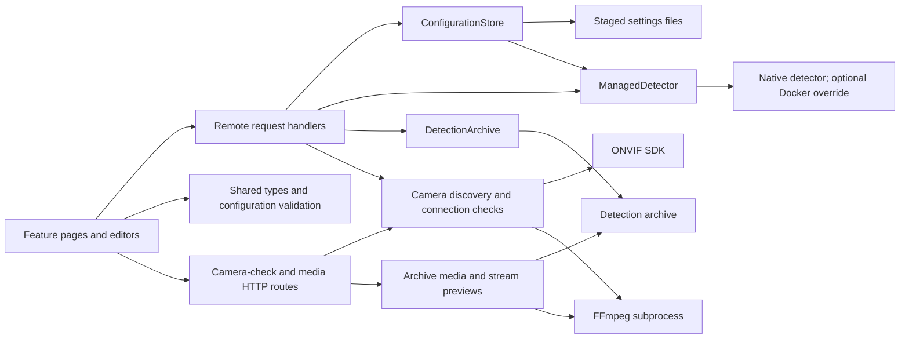

# Web application architecture

Start with the three pages people use every day: `routes/(admin)/detections` (Recordings), `streams` (Cameras) and `detectors`. Each owns its objects: cameras are added on `/streams/add` and changed on `/streams/[id]`; detectors are created and edited on `/detectors/add` and `/detectors/edit`. `/setup` is first-run guidance only. It renders the same `camera-add.svelte` and `detector-editor.svelte` components in three steps and ends by starting monitoring. `lib/components/camera-add.svelte` owns discovery, connection and save state for one camera or several and calls `lib/remote/camera.remote.ts` to find devices and resolve their stream profiles. `lib/camera-check.ts` checks a short recording through the `/camera-checks` HTTP route; leaving the form cancels the fetch and its FFmpeg work. The picture appears beside each camera's name field; saving confirms the camera without a separate test screen, playback requirement or checkbox. `camera-settings.svelte` renames, reconnects or removes one saved camera. The detector editor selects presets, camera assignments, recipients and the Validator through `lib/remote/detector.remote.ts`. All of them use `lib/server/configuration/store.ts`, which validates the canonical detector schema, persists settings and applies changed monitoring settings to the managed detector. The components do not know where files live or how a process is started.

```mermaid
flowchart LR
    UI["Feature pages and editors"] --> Remote["Remote request handlers"]
    UI --> Models["Shared types and configuration validation"]
    Remote --> Config["ConfigurationStore"]
    Remote --> Runtime["ManagedDetector"]
    Remote --> Archive["DetectionArchive"]
    Remote --> Cameras["Camera discovery and connection checks"]
    Cameras --> ONVIF["ONVIF SDK"]
    Cameras --> FFmpeg
    UI --> Routes["Camera-check and media HTTP routes"]
    Routes --> Cameras
    Routes --> Media["Archive media and stream previews"]
    Config --> Files["Staged settings files"]
    Config --> Runtime
    Archive --> Disk["Detection archive"]
    Media --> Disk
    Media --> FFmpeg["FFmpeg subprocess"]
    Runtime --> Process["Native detector; optional Docker override"]
```

## Where a change belongs

| Concern                                       | Read first                                                                                                                | Regression tests                                                                     |
| --------------------------------------------- | ------------------------------------------------------------------------------------------------------------------------- | ------------------------------------------------------------------------------------ |
| Setup and request validation                  | `lib/configuration.ts`, `lib/server/configuration/store.ts`                                                               | `configuration.test.ts`, `detector-editor.test.ts`                                   |
| Detector, camera and notification edit rules  | `lib/server/configuration/detectors.ts`, `cameras.ts`, `telegrams.ts`                                                     | `configuration.test.ts`                                                              |
| Settings persistence and failure recovery     | `lib/server/configuration/files.ts`, `lib/server/json-file.ts`                                                            | `configuration.test.ts`                                                              |
| Starting, stopping, restarting and resuming   | `lib/server/managed-detector.ts`, `lib/server/detector-preparation.ts`, `lib/server/runtime-platform.ts`                  | `runtime.test.ts`, `runtime-recovery.test.ts`                                        |
| Archived detections, pagination and playback  | `lib/server/archive.ts`, `lib/server/archive-media.ts`, `lib/detections.ts`                                               | `archive.test.ts`                                                                    |
| Camera discovery, connection, test recording  | `lib/server/cameras/`, `lib/cameras.ts`, `lib/camera-check.ts`                                                            | `cameras.test.ts`, `camera-check.test.ts`, `production/camera-cancellation.test.mjs` |
| Camera and alert assignment                   | `lib/server/configuration/cameras.ts`                                                                                     | `camera-configuration.test.ts`, `telegram.test.ts`                                   |
| Operational readiness                         | `lib/server/runtime-status.ts`, `lib/runtime.ts`                                                                          | `runtime-status.test.ts`, `runtime.test.ts`                                          |
| Camera preview lifetime and FFmpeg resolution | `lib/server/preview-pool.ts`, `lib/server/stream-preview.ts`, `lib/server/ffmpeg.ts`                                      | `preview.test.ts`                                                                    |
| Camera overlays and viewer lifetime           | `lib/server/live-preview.ts`, `lib/camera-overlays.ts`, `lib/components/camera-detections.svelte`, `lib/preview-slots.ts` | `live-preview.test.ts`, `camera-overlays.test.ts`, `preview-slots.test.ts`           |
| Camera connection queue                       | `lib/camera-batch.ts`, `lib/components/camera-add.svelte`                                                                 | `camera-batch.test.ts`                                                               |
| Editable form state                           | `lib/components/camera-settings.svelte`, `detector-editor.svelte`, `notification-editor.svelte`                           | Draft-helper tests plus browser verification                                         |
| Navigation and monitoring state on every page | `lib/navigation.ts`, `lib/components/app-shell.svelte`, `lib/monitoring.ts`                                               | `monitoring.test.ts`                                                                 |
| Setup checks and completion                   | `lib/hooks/setup-verifier.svelte.ts`, `lib/components/setup-finish.svelte`                                                | `setup.test.ts`, `camera-setup.test.ts`, `production/node-server.test.mjs`           |
| Look and wording shared across pages          | `routes/layout.css`, `lib/components/pill.svelte`, `page-header.svelte`, `lib/format.ts`                                  | `format.test.ts`                                                                     |
| LAN device access                             | `lib/server/access.ts`, `lib/server/device-access.ts`, `hooks.server.ts`                                                  | `device-access.test.ts`, `production/node-server.test.mjs`                           |
| Storage and diagnostic downloads              | `lib/server/storage.ts`, `lib/server/diagnostics.ts`                                                                      | `storage.test.ts`, `diagnostics.test.ts`                                             |
| Dependency direction                          | `.dependency-cruiser.cjs`                                                                                                 | `architecture.test.ts` deliberately violates the rules                               |

Paths in the table are relative to `src/` (code) or `tests/` (tests); `.dependency-cruiser.cjs` is at the web project root. `lib/server/configuration/index.ts` is the composition point for the singleton store; `lib/server/detector-service.ts` owns the singleton runtime. Other services accept their dependencies explicitly and can be tested with Node's test runner. There is no container or generic repository framework.

Tests follow these boundaries. `pnpm test` runs source behavior, `pnpm test:desktop` exercises the desktop host, and `pnpm test:production` checks the built server. Recovery policy tests use Node's test clock to advance backoff while subprocess I/O still runs in real time. They retain real child exits, signals, draining and cancellation; the clock only removes waiting. Configuration fixtures create cameras and detectors through their separate public operations. Keep persistence/rollback tests at the store boundary and JSON file tests in `json-file.test.ts`.

`node-server.mjs` starts the official Node adapter with the local HTTP transport configured. Use `pnpm start`; HTTPS reverse proxies supply an explicit `ORIGIN` (see the README). `tests/production/` tests the built server, separately from the fast source tests.

The executable adapter delegates lifecycle to `desktop/runtime.ts`. That runtime binds the port before initializing SvelteKit, owns the parent pipe and shutdown, and delegates LAN discovery to `@homebridge/ciao`. The library probes `ai-detector.local`, resolves name conflicts and withdraws advertisements on shutdown. It defaults to `0.0.0.0` for access from other devices, while browser launch and authenticated instance control use loopback. An explicit `HOST` overrides the binding; discovery follows the effective wildcard IPv4 binding and stays off for `HOST=127.0.0.1`. `desktop/paths.ts` supplies the same data-directory rules to the bootstrap and server stores. The adapter patch contains integration hooks rather than application behaviour. Desktop code has its own strict TypeScript configuration and participates in `pnpm quality`.

Detector process completion retains its exit status. A failed or forced drain rejects shutdown through the service hook to the desktop runtime; it cannot become a successful native update restart. The native shell owns error dialogs and receives a bounded `AI_DETECTOR_ERROR ` summary through stderr. Compiled-executable tests cover successful, failed and timed-out draining with a local detector fixture.

The native process owner recognizes `AI_DETECTOR_STOPPING` on its private stderr pipe as explicit application shutdown. Without that marker (or its own Quit request), even exit zero triggers recovery. The runtime writes a small `desktop-shutdown.json` receipt before exiting so a reattached menu can distinguish intentional shutdown, failed draining and a disappeared process. Receipts match the connected instance token; an older receipt cannot authorize a newer instance’s shutdown. Browser polling never drives recovery.

## Boundaries and ownership

`server/detector-log.ts` owns a bounded transcript of the latest monitoring attempt, including configuration checks and CUDA downloads before Python starts. It retains the first 32 Ki characters and latest 96 Ki characters, with an omission marker when necessary. Complete stdout/stderr lines are redacted and stripped of terminal escape codes before capture. The existing atomic-file library persists `logs/application.log` at most once per second during activity and flushes at failure/shutdown. A new manual start replaces the transcript; automatic recovery retains it. A write failure is reported to the server console and does not stop monitoring.

The Logs page reads this transcript separately from runtime status, so other screens no longer poll log output. HTTP ETags avoid resending unchanged text. Search preserves complete timestamped messages and tracebacks; scrolling up pauses following the latest output. Download diagnostics uses `diagnostics.ts` and the existing ZIP writer to collect rotated logs, the latest eight TensorRT build logs, OS/runtime details and redacted settings. It excludes recordings, device tokens and raw recovery backups. Known settings secrets, URL credentials and terminal escapes are removed; local paths and camera addresses remain useful diagnostic data. The route does not load the validated configuration store, so broken JSON does not prevent downloading evidence. Separately managed installations expose a bounded tail of the existing Python `logs/detector.log`. There is no log database or unbounded history.

Shutdown diagnostics record their origin: monitoring disabled, saved detector settings applied, an OS signal, an authenticated desktop quit request, or an explicit native-launcher command. Losing the native menu’s pipe is logged separately and leaves monitoring running. The desktop runtime passes that reason through the shutdown hook into the monitoring log. Configuration restarts retain the transcript so the reason survives the next launch. The Python CLI separately distinguishes an explicit `stop` command from losing its parent connection. Exit code zero alone does not establish that a user chose to stop. The native menu can reopen and control the same background instance without starting another detector.

The detector reports `models_ready` once after its background TensorRT queue finishes with at least one newly available engine. `RuntimeProgress` validates the record without treating it as camera readiness. `ManagedDetector` binds the request to its current child and uses the same serialized drain/restart operation as configuration changes. Duplicates from the old child cannot restart its replacement. Pause/quit aborts this operation before relaunch, including while accepted events are draining. This planned restart retains monitoring settings and logs and does not increment crash backoff. Failed-only, cached-only and cancelled builds emit no request; model readiness needs no polling timer or additional restart scheduler.

- Shared types describe configuration, runtime status and archive records. `lib/generated/` contains TypeScript declarations generated from the Python-owned JSON schemas by `json-schema-to-typescript`, a development dependency. `lib/schema.ts` derives the web's normalized lists and empty-setup types from those declarations, and infers web-only metadata types from Valibot schemas. `lib/configuration.ts` composes request schemas and uses Ajv with the Python-generated detector schema; it does not maintain a second detector schema. Archive category and stage belong to the web's `Detection` type, not to the detector's metadata file.
- Remote handlers own SvelteKit request validation, redirects and translating expected input errors. They call server services directly, not other remote handlers.
- `ConfigurationStore` serializes reads, edits, persistence and runtime application in one web process. It decides what is saved and when; `configuration/settings-files.ts` owns the files themselves: reading both, saving settings found in an earlier form, the recovery snapshot, dated copies before recovery, and the paired devices. Changed detector settings are staged together with their metadata; ordinary replacement failures restore the previous metadata before rejecting the save. This is not a cross-process lock or a power-loss-safe transaction; do not run multiple web writers against the same data folder.
- Configuration edit modules operate on the in-memory document: `detectors.ts` preserves preset identity, `cameras.ts` maintains source references, `telegrams.ts` propagates recipient changes, and `llms.ts` applies shared AI connection changes while retaining each detector's question. Shared assignment is implemented once in `lib/llm.ts`; scalar/list VLM input is normalized into lists at the configuration boundary. The reusable connection form is used on the connections page and inside the detector dialog. Creating a connection does not persist the detector draft. They do not load files, start processes or save settings. Callers use the store's public operations so every edit stays inside its serialized read/save/apply boundary.
- `ManagedDetector` serializes lifecycle commands. Stop cancels queued startup work and saves the disabled choice before draining, so a crash during draining cannot re-enable monitoring; child checks finish before temporary files are deleted, and process output is bounded and redacted. Browser polling observes state; it does not create processes. `DetectorPreparation` owns disposable validation/connection checks and native or Docker command preparation; the manager alone owns the long-running child, readiness and restart queue.
- `nvidia-runtime.ts` prepares the CUDA environment for supported NVIDIA GPUs on Windows 10 and Windows 11 using the bundled uv executable and exported dependency lock. Explicit ONNX provider choices bypass it. Hardware selection is separate from installation; existing start/stop serialization owns all child processes and cancellation. Runtime identity follows dependencies, while the executed detector source belongs to the installed app. Completion requires a GPU kernel check, failures remain visible, and cached launches avoid installation/network work. `nvidia-runtime.test.ts` covers this lifecycle; `nvidia-runtime-installed.test.ts` exercises real packages in Windows application CI.
- While monitoring is enabled, `ManagedDetector` retries every unexpected detector exit, including exit zero and termination signals, including native crashes without a Python traceback. The delay doubles from two seconds to a maximum of thirty seconds, with no attempt limit; a process that ran for ten minutes resets that delay. Failed startup during recovery or resuming an enabled installation also keeps retrying. The original launch's abort signal cancels recovery on pause or quit, and explicit shutdown intent survives a drain failure or timeout so it cannot accidentally trigger recovery. Managed monitoring remains enabled even when a finite input completes; use the standalone CLI for one-shot file processing. Applying settings resumes enabled monitoring even if draining the old detector fails. Recovery retains bounded diagnostic logs, shows the failure and next retry, resets readiness, and reuses the existing validation/start path and saved settings. Initial setup validation failures remain actionable errors without enabling monitoring. The Mac and Windows native launchers separately restart an unexpectedly exited web process with the same capped backoff; explicit application shutdown suppresses that restart. Resuming an enabled installation restores the saved diagnostic transcript.
- `hooks.server.ts` initializes monitoring during server startup, independently of browser requests. Automatic mode selects the bundled native runtime. Packaged relaunch/quit belongs in `desktop/`; native menus and installers belong in `distribution/`. Request handlers do not own desktop lifecycle.
- `RuntimeProgress` consumes the detector’s versioned status records. A spawned process is not a ready camera: every configured rule must report completed processing, frames must remain fresh, and recording failures remain attributed to their own destinations. Human logs are diagnostic text, never the readiness protocol.
- `lib/components/app-shell.svelte` is the frame around every page after setup: a sidebar on wide screens, a top bar and bottom tabs on phones, from the single list in `lib/navigation.ts`. `lib/monitoring.ts` turns runtime status into one summary (label, explanation, whether to interrupt, next action) that the navigation, the banner on the three main pages and `/status` all share. `/setup` uses a plain header instead, because nothing else is useful before monitoring has started.
- Read a polled query once with `await`, then follow `query.current`. Awaiting it inside `$derived` suspends every other pending update on the page until the next answer arrives. For the same reason a form navigates before it is removed from the page, and rows that need several computed values take them from one `$derived` list in the script instead of several `{@const}` tags.
- The admin layout provides one runtime monitor through Svelte context. `lib/hooks/runtime-status.svelte.ts` uses SvelteKit's query for data, loading and errors; Svelte's `createSubscriber` starts a single polling loop while any view reads its status and stops it after the last view leaves. The camera page and monitoring card share the last successful check time and ten-second stale threshold. Start/stop commands refresh that same query. Failed refreshes retain the last good status while showing that it is unavailable.
- Camera discovery uses the ONVIF SDK; FFmpeg checks actual recording and playback. Temporary checks expire after 15 minutes, are bounded, and use opaque URLs. Saved camera previews use stable IDs; credentials never belong in navigation URLs.
- Camera edits preserve IDs, existing rules and alert relationships. Camera requests only add a view-only source or update an existing source; detector creation and preset selection belong exclusively to the detector editor. The store does not load preset files. Alert assignment belongs to selected detectors.
- `PreviewPool` owns one capture/encoder per source and FFmpeg executable, shared across browser viewers. Each viewer retains only its newest undelivered JPEG. Leaving one view does not stop another; the last departure cancels and reaps the producer. Server shutdown closes the pool. The underlying stream owns its FFmpeg child until the child closes. FFmpeg samples received pictures at up to eight per second without duplicating frames across camera timestamp gaps after sleep or a network interruption. Preview filtering and JPEG encoding each use one thread. The Remix multipart parser separates complete JPEGs while stdout is continuously drained. A slow browser receives the latest picture, replacing superseded pictures instead of backpressuring camera capture; per-picture memory stays bounded. Multipart upload count/total limits are disabled for these ongoing streams. Client disconnects, frame timeouts and EOF all release the child; a force-kill deadline survives closing the HTTP response.
- Analysed previews use the detector's [latest-frame transport](../detector/LIVE_PREVIEW.md), without opening another camera connection. `lib/live-preview.ts` owns the Valibot frame schema and infers its shared type; the web adds the configured rule label. `server/source-key.ts` derives the detector's key for a camera source, once, for both these previews and monitoring status. The server validates records once and owns viewer leases/SSE cleanup. The UI shows matching image/boxes, tracks connection freshness, and releases invisible previews. `PreviewSlots` caps active feeds at four per browser tab. Live views never establish recording or alert success.
- Adding cameras coordinates bounded ONVIF connection attempts and keeps successful results in memory. Each selected camera still passes the automatic recording check, inline preview, configuration save and completion checks. One camera is the same path with a queue of one; there is no second persistence path or bypass around verification.
- Archive reads validate metadata and confine decoded paths and symbolic links to the archive. Directory listings are cached by modification time, reviews for thirty seconds, and immutable event IDs after their first read. Manual reviews update this cache immediately. Malformed/missing recordings are skipped with a visible warning while other recordings remain readable; permission and storage failures still propagate. A repaired recording clears its warning. Explicit cleanup invalidates all archive caches. Videos stream with byte ranges rather than loading into memory in full. The small range parser preserves oversized suffix ranges and serves unsupported multipart ranges in full; `archive.test.ts` covers these protocol cases. The card identity includes category, stage and timestamp; overlapping offset pages are deduplicated when new events arrive.
- `recording-export.ts` selects complete archived events through `DetectionArchive.locations()` and includes their regular media files and metadata. It shares category/stage selection with pagination, with optional inclusive calendar dates validated in `detections.ts`. `settings-backup.ts` snapshots both settings documents through the store's read queue. Both use `zip-download.ts`: Archiver handles ZIP encoding and ZIP64, while a sequential producer, bounded streams and cancellation control disk reads. Downloads use the browser's download manager rather than buffering large blobs in the frontend. `exports.test.ts` covers selection, byte preservation, path confinement, backpressure, cancellation and backup/import compatibility; production tests exercise both HTTP routes.
- Remote command failures are SvelteKit `HttpError` objects. `lib/remote-errors.ts` reads their public message for actionable feedback instead of replacing expected errors with a generic message.
- The `/advanced` route owns JSON drafts for `config.json` and the shared AI connections. The engine choice is `runtime` in `config.json`; `ManagedDetector` reads it at every start, so saving a change restarts enabled monitoring with it. Whether monitoring resumes with the application is `monitoring` in `app.json`. That key belongs to the launcher: the store's documents never contain it, every store write keeps whatever is on disk at that moment, and backups, imports, recovery snapshots and settings revisions therefore never see it. `monitoring-flag.ts` gives the two writers of `app.json` one short file lock; neither holds it while waiting for the other's queue. The Monitoring page edits the address and interval of `health` through `ConfigurationStore.saveHeartbeat`, leaving its other options as set in Advanced. `advanced-settings.ts` supplies bundled schemas and immediate validation; `settings.remote.ts` repeats validation before using the store. Store revisions reject stale edits. Basic forms do not embed editors. Snapshot detectors keep their absent/null YOLO configuration.

There are no separate domain/use-case/port folders here because this application primarily coordinates files and processes. Concrete services and small shared models express the current boundaries without mirroring the detector's richer event domain.

## Settings save boundary

Legacy imports enter through the existing setup page and `installation-import.remote.ts`. Only the dashboard on this computer may select local folders. `server/installation-import/configuration.ts` handles the one known legacy option and relocates local file references; canonical configuration validation still owns accepted detector settings. `files.ts` copies into staging, while `service.ts` coordinates inspection, progress and an on-disk recovery manifest. Files are copied outside the settings queue. Publication and `ConfigurationStore.initialize()` run inside it, reject existing setup/data, and deliberately do not apply runtime changes. Import publication is journaled so a restart can finish its own folder moves and settings write. This recovery belongs specifically to first-run import; it does not change the ordinary edit transaction described below. `tests/installation-import.test.ts` covers old archive readability, retained settings, interruption recovery and overwrite prevention.

Preset definitions are the JSON files in `config/detector/`, embedded automatically by Vite. `configuration/preset-files.ts` enumerates files, derives names from filenames and validates detector options against the canonical schema. `configuration/presets.ts` selects a local `presets/` folder in the data directory, an explicit `AIDETECTOR_PRESETS` directory, or the bundled files. Choices are sorted by filename; users select a preset explicitly. There is no separate catalogue, description or default-preset metadata. The Advanced editor uses the same bundled detector schema as save validation, with empty setup allowed; it never fetches a different schema from the configuration’s `$schema` URL.

`ConfigurationStore` receives the preset loader explicitly. Only choosing a new preset loads its definition during a camera save. Camera actions use a separate `mode` (`preset`, `keep`, `copy`, `view-only`); preset IDs are filename stems, including names that happen to match an action. A saved detector owns its copied configuration, not a live reference to a preset file. Existing IDs and actual rule settings survive preset edits, renames or removal; missing names fall back to the saved detector label. There are no use-case-specific branches in the application.

Camera setup proof lives with camera metadata: picture confirmation, recording-location check, alert choice and completion. `lib/hooks/setup-verifier.svelte.ts` checks pictures and recording locations sequentially; `lib/components/setup-finish.svelte` shows each camera's result, offers retries after failures and finishes once every camera is processing. `lib/remote/camera-setup.remote.ts` exposes the combined review and finish commands. Finishing checks every camera in one serialized save operation; if any camera is unready, none is marked complete. Connection metadata contains only a safe ONVIF endpoint/profile, never another copy of login credentials. Archive checks copy and decode a temporary setup clip at the configured location, remove it afterward and publish no detection event. Completion is tied to current detector settings and checked against current runtime state; persisted completion is not a live health claim.

Telegram pairing is a bounded local interaction in `lib/server/telegram-pairing.ts`; its separate session identifier and one-use link code expire after five minutes. The grammY `Api` client handles Telegram transport, serialization and request deadlines in `lib/server/telegram.ts`; this adapter validates the reply fields used by setup and translates failures into actionable messages. It uses the Fetch-compatible `grammy/web` entrypoint in both Node and Bun. Pairing owns cancellation and exclusive bot reservations. `telegram-inbox.ts` shares durable offsets and recent chat discovery between pairing and background review callbacks. `telegram-service.ts` polls connected bots while the web server is running, including while monitoring is paused; setup reserves the bot and waits for an existing background request to finish. There is one consumer per token, including when several chats reuse a bot. Polling and QR generation do not hold the configuration write queue. The browser lifetime helper retires late responses and cancels abandoned sessions. Existing recipients reuse the camera/alert save boundary; unchanged credentials do not require a repeated receipt confirmation. Pairing and reviews use the same update filter. Receiving reviews requires a dedicated bot without an external webhook or another polling application; manual destinations managed elsewhere can still receive outgoing alerts. Group/channel selection uses Telegram’s native chat picker. The final callback verifies the initiating user, chat, message and nonce before reporting a confirmed recipient. Bot reuse is derived from saved recipient tokens rather than another configuration entity.

Validation precedes any replacement: the shared schema checks every save, and a managed detector validates changed, nonempty detector settings. When detector settings change, `configuration/files.ts` stages both new JSON files and the exact previous `app.json` bytes beside their destinations. It replaces `app.json` first, then `config.json`, using a rename for each file. If the second replacement fails, it restores the staged metadata or removes the new `app.json` when none existed before. A failed restore reports both failures and retains the available metadata backup for manual recovery. Temporary-file cleanup failures are logged without changing the outcome of an already committed save.

The pair is **not atomically visible to other processes**, and a crash or power failure between replacements can leave mismatched files. There is no filesystem journal or automatic two-file crash recovery. This deliberately small boundary handles normal I/O rejection without changing the existing file formats; a separate validated recovery snapshot supports explicit restoration without changing that transaction guarantee.

After both replacements succeed, the saved configuration remains authoritative. A failure applying it or stopping the managed runtime updates runtime failure status and does not reject the successful save, so a client does not retry an already created camera. A save result does not mean monitoring is ready; readiness comes from the runtime's status records. Metadata-only edits use `json-file.ts`, leave `config.json` untouched and skip the detector executable's validation and restart. The single-file writer delegates replacement, file synchronization and temporary-file cleanup to `write-file-atomic`, with private settings permissions. Preview leases use the same library without synchronization because they expire; their viewer lifetime remains owned by `live-preview.ts`. This library does not replace the two-file save/rollback boundary.

`configuration.test.ts` covers validation and staging failures, replacement rollback with existing or missing metadata, rollback and cleanup failures, queue recovery, concurrent camera additions, metadata-only edits, and an actual managed-runtime settings-write failure after a completed save.

## Quality commands

`pnpm quality` checks generated schema declarations, formatting, ESLint, strict Svelte/TypeScript checking, that the translation catalogs match the source, dependency rules and behavioral tests. Run `pnpm schema:generate` after regenerating the Python JSON schemas; `pnpm schema:check` reports drift without rewriting files. Application functions have an ESLint cyclomatic complexity ceiling of 15 and nesting ceiling of 4. Those limits prompt review; they do not prove readability or justify splitting a coherent function just to lower a number. The preserved shadcn library is excluded from the complexity ceiling, not from type or formatting checks.

`pnpm test:coverage` measures executed shared/server code. It does not measure browser interactions or prove platform behavior. `pnpm build` checks the actual adapter output. `pnpm test:production` then exercises the built Node server over HTTP, including setup, origin checks and process shutdown. CI runs all three.

`pnpm architecture:graph` writes `.reports/dependencies.mmd`, a Mermaid graph of server code and its local dependencies; open it beside the source in VS Code. `pnpm architecture:metrics` prints module coupling metrics. The checked rules reject feature cycles, presentation imports from services, Node imports from browser/request code, and unresolved project imports. The negative test proves alias, dynamic import and type-only violations are detected.

Dependency-cruiser uses its own resolver: `tools/dependency-resolution.mjs` supplies SvelteKit's `$lib` alias and TypeScript `.js` imports. Its pinned patch enables the same Svelte async compiler flag used by the app. Remove that patch when the analyzer supports this option directly. SvelteKit virtual imports and third-party package resolution are checked by Svelte/Vite; project import resolution is checked by the dependency graph too.

`/setup` keeps its step in the URL, so saving the first camera or detector cannot change the page under someone who is still adding more. `/` opens it until monitoring has been started once; a separately managed detector cannot be started here, so that installation leaves setup after saving. `camera-add.svelte`, `camera-settings.svelte` and `detector-editor.svelte` own their drafts and report completion to the page that rendered them. Telegram and Validator dialogs retain the detector draft. Links from both earlier layouts (`/streams/add?id=`, `/detectors/add?label=`, `/setup?…&camera=` and `/setup?…&detector=`) redirect to the page that now owns the item.

### Appearance and the shadcn components

`routes/layout.css` holds the theme: colors for both appearances, status and category tones, radius and page widths. `mode-watcher` follows the device unless a choice is saved under Settings. The components in `lib/components/ui` are the published shadcn-svelte files and are not restyled or extended, so `pnpm shadcn` can replace them. Application-specific variants live beside the feature components: `pill.svelte` adds status and category tones to the badge, and `filter-chips.svelte`, `link-rows.svelte` and `page-header.svelte` compose the rest. ESLint skips that folder; formatting and type checks still cover it. Camera pictures and clips use the `media` surface, which stays dark in both appearances.

### Languages

The interface is written in English in the source and translated at build time by [Wuchale](https://wuchale.dev): `wuchale.config.js` lists the languages (from `lib/locales.ts`), the Vite plugin replaces text with catalog lookups, and `src/locales/<language>.po` holds the translations. Nothing is wrapped in a translate call. The `.po` files and the four loaders beside them are sources; `src/locales/.wuchale/`, `data.js` and `plural.js` are generated by `pnpm check`, `pnpm dev` and `pnpm build`, and ignored by Git.

An installation has one language, `language` in `app.json`. The store records it from the first browser that saves settings (`requested` in `LanguageSource`), so setup asks nothing; the menu in the setup header and under Settings changes it with `saveLanguage`. Until one is saved, each request is answered in the best match for its `Accept-Language` header. `hooks.server.ts` runs every request inside `runInLanguage` (`server/request-language.ts`, an `AsyncLocalStorage`), and names the language on `<html lang>`; `routes/+layout.ts` loads the same catalog in the browser before hydration. The server loaders (`locales/server.js`) pick the catalog of the request being answered and fall back to the installation's language for work no request started: a detector that stops by itself, a Telegram review reply. Wuchale's own server loader returns empty text there, which is why the loaders are custom.

Rules that keep text translatable:

- In `.ts` files, text outside a function is not translated (and would be fixed at the language of whichever request loaded the module). Return it from a function, as `navigation.ts` and `stageLabel` do; give Valibot a message function, `v.minLength(1, () => 'Enter a name.')`.
- Write whole sentences. Do not join fragments or add an `s`: use `plural(count, ['# camera', '# cameras'])` from `lib/format.ts`, which also receives the catalog's plural forms and language. Text that starts in lower case is skipped by the extractor.
- Dates and numbers go through `lib/format.ts`, which formats in `language()` so a page reads as one language on the server and in the browser.
- Thrown messages are shown to people here, so `wuchale.config.js` extracts `throw` statements too. Log lines (`log.append`, `webLog`, `console`), header names and file names are excluded there; mark anything else that must stay as written with `/* @wc-ignore */`, as `connectionFailure('No space left on device')` does because the code matches that wording.
- Do not compare against translated text; compare codes (`tone`, `stage`, `phase`).
- The components in `lib/components/ui` are translated without editing them.

`language.test.ts` fails when a catalog is incomplete or a translation changes a placeholder, and `pnpm i18n:check` (part of `pnpm quality`) fails when the catalogs do not match the source. After changing text run `pnpm i18n`, then fill the new empty `msgstr` entries in each `.po` file, using the terms in [`src/locales/README.md`](src/locales/README.md). Automatic translation is switched off (`ai: null`) so nothing is sent to a service unasked. Tests import the source directly and therefore see English. Not translated: logs and diagnostics, the JSON editor's schema descriptions, messages the Python detector reports (camera and model errors, the duration line of a Telegram alert), and the native launcher menus.

### Manual recording review

`server/recordings.ts` owns the shared archive service. Web commands and Telegram callbacks serialize review changes through it. New detector deliveries share a UUID across disk and Telegram destinations; older archives remain reviewable in the web app by their original location. Telegram callbacks require a currently connected bot/chat and resolve an event ID, never a client-supplied file path. Albums receive a silent review message replying to the album because Telegram media groups cannot carry inline buttons.

`metadata.json` is the only file describing a recording. The latest human verdict, origin and timestamp are its `review`, which overrides the displayed/filterable stage while `validated` beside it keeps the original validator outcome. The detector publishes the file once and never rewrites it; the web replaces it atomically, changing only `review` and keeping the file's permissions. Undo removes `review`. A recording whose metadata cannot be read has no review and stays listed in its original stage; a `review` that is present but invalid excludes the recording with a warning and is never overwritten. Listing reads these reviews a few at a time. At startup `adoptLegacyReviews()` moves any `review.json` written by an earlier version into the metadata once, keeps a review already there, and leaves an unreadable file in place with a logged warning. Media paths and list keys use `archiveStage`, so playback survives changes. Visible recordings refresh reviews without replacing video elements. ZIP exports snapshot the reviews, group media by effective stage, include provenance, and disambiguate colliding original timestamps. Tests: `archive.test.ts`, `exports.test.ts`, `telegram-reviews.test.ts`, `telegram-pairing.test.ts`.

## Access, supervision and maintenance

`hooks.server.ts` calls `access.authorizeRequest` before every dynamic route, remote command or media request. `DeviceAccess` owns one-use pairing codes in memory. `ConfigurationStore` stores paired devices and hashed browser tokens in `app.json` through its existing write queue; access changes do not affect `config.json` or restart the detector. Access reads validate only the device records, so paired browsers can still reach diagnostics and recovery with invalid detector settings. A damaged `app.json` leaves local recovery available. Exported settings, diagnostics and recovery snapshots exclude device access; import and recovery preserve the destination's current devices when readable, so restoring settings cannot revive revoked access. Sessions last one year, use HttpOnly/SameSite cookies and are revocable. Local automatic access requires both the actual loopback peer and loopback URL host, without a cross-site initiator; forwarded headers do not grant access. `authorizeRequest` records that decision in `locals.deviceId`; the import gate and the Devices page ask `isLocalDashboard` rather than judging the request a second time. The compiled adapter returns no address when it cannot determine the peer. LAN users pair by QR or six digits; headless first startup prints a temporary code. Writes also require a matching Origin. Plain HTTP is limited to trusted networks; pairing does not encrypt traffic. Static application assets remain public. Test boundaries live in `device-access.test.ts` and the existing production HTTP suite.

The manager checks processing progress every five seconds, independent of browser polling. After `ready`, fresh frames without completed work for `max(120 seconds, 3 × rule freshness window)` request a serialized drain/restart. The rule window accounts for its sampling interval. Offline input and preparation are excluded. A scheduling gap over thirty seconds grants two minutes for suspend recovery. Child closure clears the timer; pause and quit cancel pending work. Backend and per-destination failure/recovery records are separate from camera readiness.

`storage.ts` owns free-space reporting, date-based completed-recording cleanup and paused model-cache cleanup. Free space is measured on the archive's actual volume, including imported directory links. Recording deletion uses `DetectionArchive.addresses()` independently of metadata validity, requires the same address-list revision shown at confirmation, stays within archive paths and excludes `.pending`. Filtered exports still resolve manual reviews through `locations()`. Cache cleanup runs inside the manager queue so it cannot race startup. Configured originals and custom paths are retained. The storage and runtime tests cover preservation and the pause requirement.

`SettingsFiles` remembers each new valid revision in `config.json.last-valid`. A legacy config without app metadata omits `app` from its snapshot; a new installation without a config creates no snapshot. Missing previously saved files and broken settings cannot overwrite the recovery copy. Recovery validates it, keeps dated copies of current files, then uses the existing save boundary. The standalone recovery route and diagnostics download remain usable outside the admin layout. Access reads bypass the settings queue and read atomically committed `app.json`, so a slow runtime apply cannot block paired browsers. Device and settings writes remain serialized. Detector drafts keep non-secret references through `detector-draft-storage.ts`; `detector-editor.ts` holds the editor's changes as plain functions, including the projection of those references and their restoration, and the component only shows the result; unavailable or full browser storage never prevents Save, Delete or Cancel. No database or background settings synchronizer is introduced.

`desktop/network-addresses.ts` supplies the LAN candidates for both desktop links and QR pairing. It filters common virtual/VPN interfaces and prefers physical adapters; multiple candidates remain selectable. Pairing from an already reachable remote hostname keeps that origin. A local address alone cannot prove another device can reach it through a firewall.

`bounded-log.ts` retains startup and recent output for both detector transcripts and `web.log`. Web warnings/errors include operation, exception type, OS error code and stack frames without serializing exception inputs. Hooks initialize and flush the log; archive/recovery failures use it explicitly. The Logs page includes it, and diagnostics flush it before collecting the ZIP. `diagnostics.test.ts` and the production HTTP suite cover retention, redaction and failed recovery.
